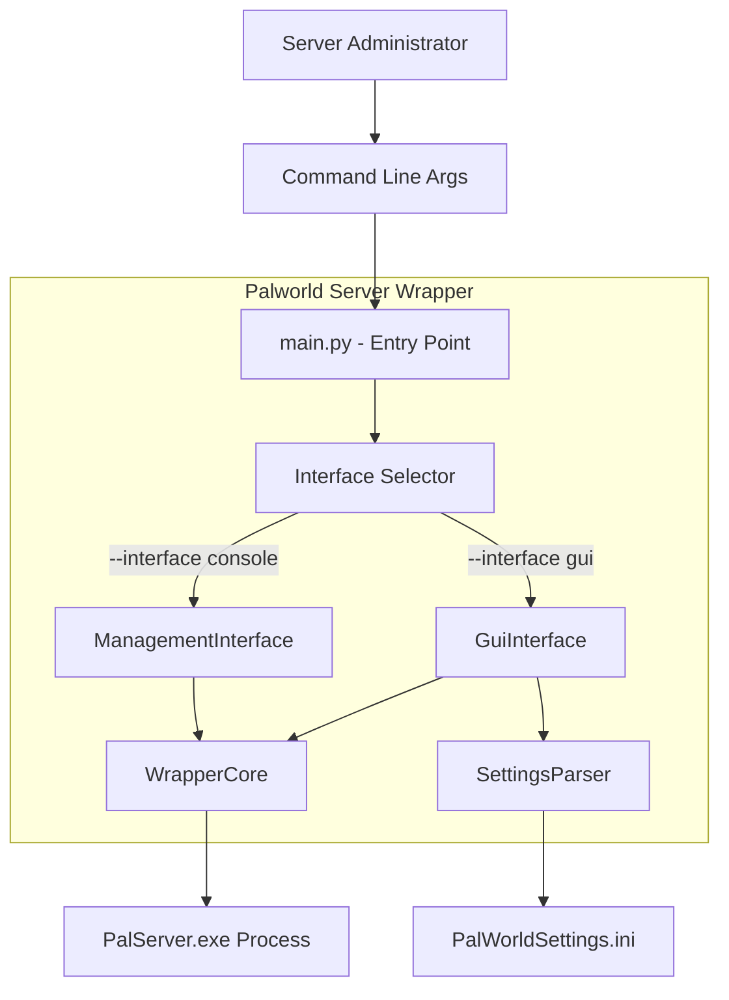

# Technical Design: GUI Management Interface

## Overview

This design describes a tkinter-based GUI management interface for the Palworld Dedicated Server Wrapper. The GUI replaces the existing console-based `ManagementInterface` as the default interaction mode while preserving all current functionality: server lifecycle control (start, stop, restart), real-time status display, settings viewing/editing, help documentation, and graceful shutdown.

The key technical challenge is integrating tkinter's event loop with the existing asyncio event loop without blocking either. The design uses a **cooperative scheduling pattern** where an asyncio coroutine periodically calls `root.update()` (every ~33ms) instead of running tkinter's blocking `mainloop()`. This ensures WrapperCore's background tasks (RCON polling, idle timer, maintenance timer, connection listener) continue executing on schedule.

**Key Design Decisions:**
- **tkinter** (Python stdlib) chosen to satisfy the zero-dependency, lightweight resource constraint
- **Cooperative async/tkinter integration** via periodic `root.update()` calls from an asyncio task
- **Same WrapperCore API** — the GUI calls the same `start_server()`, `stop_server()`, `restart_server()`, `get_status()`, `quit()` methods as the console interface
- **Interface selector** via `--interface` CLI argument with `gui` default and `console` fallback
- **Single-file module** (`src/gui_interface.py`) to keep the design simple and maintainable

## Architecture

### System Context



### Async Integration Architecture

```mermaid
sequenceDiagram
    participant Loop as asyncio Event Loop
    participant GUI as GuiInterface.run()
    participant TK as tkinter Root Window
    participant Core as WrapperCore
    
    Loop->>GUI: Start coroutine
    Loop->>Core: Start coroutine (concurrent)
    
    loop Every ~33ms
        GUI->>TK: root.update()
        TK-->>GUI: Process pending UI events
        GUI->>Loop: await asyncio.sleep(0.033)
        Note over Loop: Other tasks run here<br/>(RCON poll, idle timer, etc.)
    end
    
    Note over GUI: On button click
    GUI->>Core: asyncio.create_task(start_server())
    Core-->>GUI: Result available via callback/status poll
```

### Component Interaction

```mermaid
graph LR
    subgraph "GUI Layer"
        GI[GuiInterface]
        CP[ControlPanel Frame]
        SD[StatusDisplay Frame]
        SV[SettingsView Frame]
        SE[SettingsEditor Frame]
        HD[HelpDialog]
        NB[NotificationBar]
    end
    
    subgraph "Core Layer"
        WC[WrapperCore]
        SP[SettingsParser]
        Config[WrapperConfig]
    end
    
    GI --> CP
    GI --> SD
    GI --> SV
    GI --> SE
    GI --> HD
    GI --> NB
    
    CP -->|start/stop/restart| WC
    SD -->|get_status()| WC
    SV -->|read_settings()| SP
    SE -->|write_setting()| SP
    SE -->|get_status()| WC
    GI -->|quit()| WC
```

## Components and Interfaces

### 1. Interface Selector (modification to `src/main.py`)

Adds a `--interface` argument to the existing argparse configuration.

```python
# Added to parse_args()
parser.add_argument(
    "--interface",
    type=str,
    default="gui",
    choices=["gui", "console"],
    help="Interface mode: gui (default) or console",
)

# Modified run_wrapper() to select interface
async def run_wrapper(config: WrapperConfig, interface_mode: str) -> None:
    wrapper_core = WrapperCore(config)
    
    if interface_mode == "gui":
        from src.gui_interface import GuiInterface
        interface = GuiInterface(wrapper_core, config)
    else:
        interface = ManagementInterface(wrapper_core, config)
    
    # Run both concurrently as before
    ...
```

The `--interface` argument uses argparse `choices` with a custom `type` function for case-insensitive matching. Invalid values produce argparse's standard error (exit code 2). If GUI mode is selected but tkinter cannot initialize (e.g., headless environment), the process logs the error and exits with code 1.

### 2. GuiInterface Class (`src/gui_interface.py`)

The main GUI class that mirrors the role of `ManagementInterface` but with a tkinter window.

```python
class GuiInterface:
    """tkinter-based GUI management interface for the Palworld Server Wrapper.
    
    Integrates with asyncio via cooperative scheduling (periodic root.update()
    calls from an asyncio coroutine).
    """
    
    def __init__(self, wrapper_core: WrapperCore, config: WrapperConfig) -> None:
        """Initialize the GUI interface.
        
        Args:
            wrapper_core: The WrapperCore instance for command execution.
            config: The wrapper configuration.
            
        Raises:
            RuntimeError: If tkinter cannot initialize (no display).
        """
        ...
    
    async def run(self) -> None:
        """Main entry point - runs the tkinter event loop cooperatively with asyncio.
        
        Calls root.update() every ~33ms (30 FPS equivalent) to process tkinter
        events without blocking the asyncio event loop.
        """
        ...
    
    def _build_ui(self) -> None:
        """Construct the complete GUI layout."""
        ...
    
    def _schedule_status_refresh(self) -> None:
        """Schedule periodic status display updates (every 1 second)."""
        ...
    
    async def _execute_server_operation(
        self, operation: str
    ) -> None:
        """Execute a server control operation in a non-blocking manner.
        
        Args:
            operation: One of "start", "stop", "restart".
        """
        ...
    
    def _show_notification(self, message: str, is_error: bool = False) -> None:
        """Display a notification message in the notification bar.
        
        Args:
            message: The message to display.
            is_error: If True, notification persists until dismissed.
                     If False, auto-dismisses after 5 seconds.
        """
        ...
    
    async def _shutdown(self) -> None:
        """Perform graceful shutdown sequence."""
        ...
```

### 3. Control Panel Widget

```python
class ControlPanel(ttk.LabelFrame):
    """Server control buttons with state-aware enable/disable logic."""
    
    def __init__(self, parent: tk.Widget, on_start, on_stop, on_restart) -> None:
        ...
    
    def update_button_states(self, state: ServerState) -> None:
        """Enable/disable buttons based on current server state.
        
        MONITORING: Start=enabled, Stop=disabled, Restart=enabled
        RUNNING:    Start=disabled, Stop=enabled, Restart=enabled
        STARTING/STOPPING: All disabled, loading indicator shown
        """
        ...
    
    def set_loading(self, loading: bool) -> None:
        """Show/hide loading indicator during operations."""
        ...
```

### 4. Status Display Widget

```python
class StatusDisplay(ttk.LabelFrame):
    """Real-time server status display with periodic refresh."""
    
    def __init__(self, parent: tk.Widget) -> None:
        ...
    
    def update_status(self, status: WrapperStatus) -> None:
        """Update all status fields from a WrapperStatus snapshot.
        
        Shows: state, player_count, idle timer info, PID, uptime.
        Omits PID/uptime fields when values are None.
        """
        ...
```

### 5. Settings View Widget

```python
class SettingsView(ttk.LabelFrame):
    """Read-only display of all server settings with password masking."""
    
    PASSWORD_MASK = "********"
    
    def __init__(self, parent: tk.Widget, config: WrapperConfig) -> None:
        ...
    
    def refresh(self) -> None:
        """Re-read settings from file and update display."""
        ...
    
    def _display_settings(self, settings: dict[str, Any]) -> None:
        """Render settings sorted alphabetically, masking passwords."""
        ...
```

### 6. Settings Editor Widget

```python
class SettingsEditor(ttk.LabelFrame):
    """Setting modification with type validation and auto-correction."""
    
    def __init__(
        self, parent: tk.Widget, config: WrapperConfig, 
        wrapper_core: WrapperCore, on_setting_changed: Callable
    ) -> None:
        ...
    
    def _on_submit(self) -> None:
        """Handle the Apply button click.
        
        Validates input, applies auto-correction, writes to file,
        displays confirmation/error, and triggers settings view refresh.
        """
        ...
    
    def _validate_and_correct(
        self, key: str, value: str
    ) -> CorrectionResult | str:
        """Same validation logic as ManagementInterface._validate_and_correct()."""
        ...
```

### 7. Help Dialog

```python
class HelpDialog(tk.Toplevel):
    """Modal help dialog with feature documentation."""
    
    def __init__(self, parent: tk.Widget) -> None:
        ...
    
    def _build_content(self) -> None:
        """Build scrollable help text content."""
        ...
```

### 8. Notification Bar

```python
class NotificationBar(ttk.Frame):
    """Status notification bar at the bottom of the main window.
    
    Success messages auto-dismiss after 5 seconds.
    Error messages persist until user dismisses them.
    """
    
    def show_success(self, message: str) -> None:
        ...
    
    def show_error(self, message: str) -> None:
        ...
    
    def dismiss(self) -> None:
        ...
```

### Widget Layout Structure

```
┌─────────────────────────────────────────────────────────┐
│ Palworld Server Wrapper                           [─][□][×] │
├─────────────────────────────────────────────────────────┤
│ ┌─ Server Control ────────────────────────────────────┐ │
│ │ [Start Server] [Stop Server] [Restart Server]       │ │
│ │                              [Loading...indicator]   │ │
│ └─────────────────────────────────────────────────────┘ │
│ ┌─ Server Status ─────────────────────────────────────┐ │
│ │ State:        RUNNING                               │ │
│ │ Players:      3                                     │ │
│ │ Idle Timer:   Not active                            │ │
│ │ Server PID:   12345                                 │ │
│ │ Uptime:       3600s                                 │ │
│ └─────────────────────────────────────────────────────┘ │
│ ┌─ Server Settings ───────────────────────────────────┐ │
│ │ AdminPassword = ********                            │ │
│ │ DayTimeSpeedRate = 1.0                              │ │
│ │ ExpRate = 2.0                                       │ │
│ │ ...                                     [Refresh]   │ │
│ └─────────────────────────────────────────────────────┘ │
│ ┌─ Modify Setting ────────────────────────────────────┐ │
│ │ Key: [_______________]  Value: [_______________]    │ │
│ │                                         [Apply]     │ │
│ └─────────────────────────────────────────────────────┘ │
│ ┌─────────────────────────────────────────────────────┐ │
│ │ [Help]                                     [Quit]   │ │
│ └─────────────────────────────────────────────────────┘ │
│ ┌─ Notification ──────────────────────────────────────┐ │
│ │ Server started successfully.                  [×]   │ │
│ └─────────────────────────────────────────────────────┘ │
└─────────────────────────────────────────────────────────┘
```

## Data Models

### Existing Models Used (no modifications)

The GUI interface reuses all existing data models without modification:

- **`ServerState`** (enum): MONITORING, STARTING, RUNNING, STOPPING — used for button state logic
- **`WrapperStatus`** (dataclass): server_state, player_count, idle_timer_active, idle_seconds, server_pid, uptime_seconds — used for status display
- **`StartResult`** / **`StopResult`** / **`RestartResult`**: success, error_message, was_forced — used for operation result notifications
- **`CorrectionResult`** (from ManagementInterface): value, was_corrected, original_input — reused for settings editor validation
- **`SETTING_DEFINITIONS`**: dict of SettingDefinition objects — used for validation logic

### New Models

```python
@dataclass
class NotificationState:
    """Tracks the current notification display state."""
    message: str
    is_error: bool
    dismiss_after_id: str | None = None  # tkinter after() callback ID


@dataclass
class GuiState:
    """Internal GUI state tracking for operation management."""
    operation_in_progress: bool = False
    shutdown_in_progress: bool = False
    current_operation: str | None = None  # "start", "stop", "restart"
```

### Validation Logic Reuse

The `CorrectionResult` dataclass and the validation/auto-correction logic (`_validate_and_correct`, `_correct_string`, `_correct_boolean`, `_validate_integer`, `_validate_float`, `_validate_enum`) will be **extracted from `ManagementInterface` into a shared module** (`src/validation.py`) so both the GUI and console interfaces can use the same code paths. This ensures behavioral parity without code duplication.

```python
# src/validation.py (extracted from ManagementInterface)
def validate_and_correct(key: str, value: str) -> CorrectionResult | str:
    """Validate and auto-correct a setting value based on its definition.
    
    Returns CorrectionResult on success, or error message string on failure.
    """
    ...
```

## Correctness Properties

*A property is a characteristic or behavior that should hold true across all valid executions of a system — essentially, a formal statement about what the system should do. Properties serve as the bridge between human-readable specifications and machine-verifiable correctness guarantees.*

### Property 1: Button state consistency with server state

*For any* ServerState value, the set of enabled/disabled buttons produced by `ControlPanel.update_button_states(state)` SHALL match the specification: MONITORING enables Start+Restart and disables Stop; RUNNING enables Stop+Restart and disables Start; STARTING/STOPPING disables all three.

**Validates: Requirements 3.4, 3.5, 3.6**

### Property 2: Password masking in settings display

*For any* settings dictionary and any key containing the substring "Password" (case-sensitive), the display output SHALL show "********" instead of the actual value, while all non-password keys show their real values unchanged.

**Validates: Requirements 5.2**

### Property 3: Settings validation round-trip parity

*For any* setting key and value string, the GUI's `validate_and_correct(key, value)` function SHALL produce the same result (same CorrectionResult or same error message) as the console interface's validation logic for identical inputs.

**Validates: Requirements 6.2, 6.4, 6.9**

### Property 4: Status display field presence based on WrapperStatus

*For any* WrapperStatus instance, the Status_Display SHALL show the PID field if and only if `server_pid is not None`, and SHALL show the uptime field if and only if `uptime_seconds is not None`.

**Validates: Requirements 4.5, 4.6, 4.7, 4.8**

### Property 5: Idle timer display format correctness

*For any* WrapperStatus where `idle_timer_active` is True, the idle timer display string SHALL contain the `idle_seconds` value and the configured threshold value in the format "{elapsed}s elapsed ({threshold}s threshold)". For any WrapperStatus where `idle_timer_active` is False, the display SHALL be "Not active".

**Validates: Requirements 4.3, 4.4**

### Property 6: Interface selector argument normalization

*For any* string that is a case-insensitive match for "gui" or "console", the Interface_Selector SHALL accept it and produce the correct interface mode. For any string that does not match either value (case-insensitive), the selector SHALL reject it with exit code 2.

**Validates: Requirements 1.1, 1.5**

### Property 7: Settings display alphabetical ordering

*For any* non-error settings dictionary, the rendered list of key-value pairs SHALL be sorted in alphabetical order by key name.

**Validates: Requirements 5.1**

## Error Handling

### GUI Initialization Failure

- **Trigger**: `tk.Tk()` raises `TclError` (e.g., no `$DISPLAY` on headless Linux, no Windows desktop session)
- **Response**: Log the error with `logger.error(...)`, print to stderr, exit with code 1
- **Timing**: Must exit within 5 seconds (Requirement 2.6)

### Server Operation Failures

- **Trigger**: `start_server()`, `stop_server()`, or `restart_server()` returns `success=False`
- **Response**: Show persistent error notification with `error_message` value; re-enable buttons per current state
- **Recovery**: User dismisses notification; buttons reflect current server state

### Settings File Errors

- **Trigger**: `SettingsParser.read_settings()` returns `{"__error__": "..."}` or `write_setting()` returns `ValidationResult(valid=False)`
- **Response**: Display error message in the relevant widget area; no data modification occurs
- **Recovery**: User fixes underlying file issue and clicks Refresh

### Unhandled GUI Exceptions

- **Trigger**: Any unhandled exception in the GUI coroutine loop
- **Response**: Log the exception; continue the asyncio event loop and WrapperCore (Requirement 9.4)
- **Implementation**: Wrap the `root.update()` call in try/except; on TclError (window destroyed), break the loop gracefully

### Shutdown Timeout

- **Trigger**: `WrapperCore.quit()` + cleanup doesn't complete within 30 seconds
- **Response**: Force-close the window (`root.destroy()`), log a warning (Requirement 8.5)
- **Implementation**: Use `asyncio.wait_for(quit_task, timeout=30.0)` with TimeoutError handling

### Shutdown Exception

- **Trigger**: `WrapperCore.quit()` raises an exception
- **Response**: Log the error, destroy the window anyway (Requirement 8.6)

## Testing Strategy

### Unit Tests

Unit tests verify specific behaviors with concrete examples:

1. **Interface selector tests**: Verify `--interface gui`, `--interface console`, `--interface GUI` (case-insensitive), missing argument (defaults to gui), and invalid values (exit code 2)
2. **Button state tests**: Verify each ServerState maps to the correct set of enabled/disabled buttons
3. **Status display formatting**: Verify format strings for idle timer, PID visibility, uptime visibility
4. **Password masking**: Verify settings containing "Password" are masked
5. **Notification auto-dismiss**: Verify success notifications schedule dismissal, error notifications persist
6. **Shutdown sequence**: Verify quit invokes WrapperCore.quit(), handles timeout, handles exceptions
7. **Settings validation**: Verify GUI validation produces same results as console for known edge cases
8. **Help dialog**: Verify help content contains descriptions of all documented features

### Property-Based Tests

Property-based tests verify universal properties across randomized inputs using **Hypothesis** (already used in the project for existing property tests):

- **Minimum 100 iterations** per property test (Hypothesis default is 100+)
- Each test references its design document property via tag comment

**Feature: gui-management-interface, Property 1: Button state consistency**
- Generate random ServerState values; verify button states match specification

**Feature: gui-management-interface, Property 2: Password masking**
- Generate random settings dictionaries with keys containing/not-containing "Password"; verify masking

**Feature: gui-management-interface, Property 3: Settings validation parity**
- Generate random (key, value) pairs including defined settings with various types; verify GUI and console validation produce identical results

**Feature: gui-management-interface, Property 4: Status display field presence**
- Generate random WrapperStatus instances with None/non-None values for pid/uptime; verify field presence

**Feature: gui-management-interface, Property 5: Idle timer display format**
- Generate random WrapperStatus with idle_timer_active True/False and random seconds; verify format

**Feature: gui-management-interface, Property 6: Interface selector normalization**
- Generate random case variations of "gui"/"console" and random invalid strings; verify acceptance/rejection

**Feature: gui-management-interface, Property 7: Settings alphabetical ordering**
- Generate random settings dictionaries; verify output is sorted alphabetically by key

### Integration Tests

- Verify GUI window opens and closes without error (smoke test)
- Verify cooperative async loop doesn't block WrapperCore operations
- Verify settings modification end-to-end: edit → validate → write → refresh view
- Verify window close event triggers proper shutdown sequence
