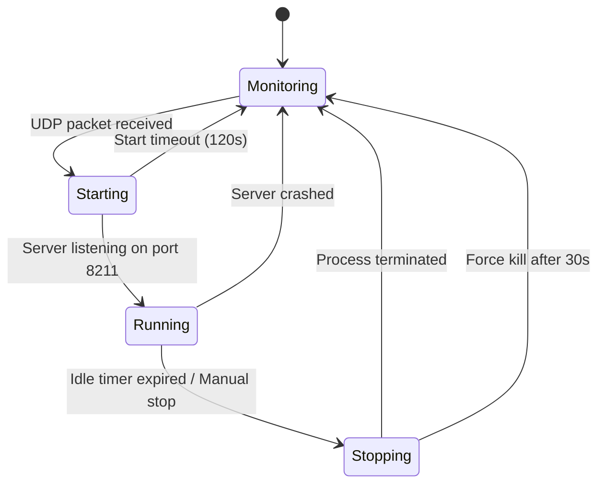
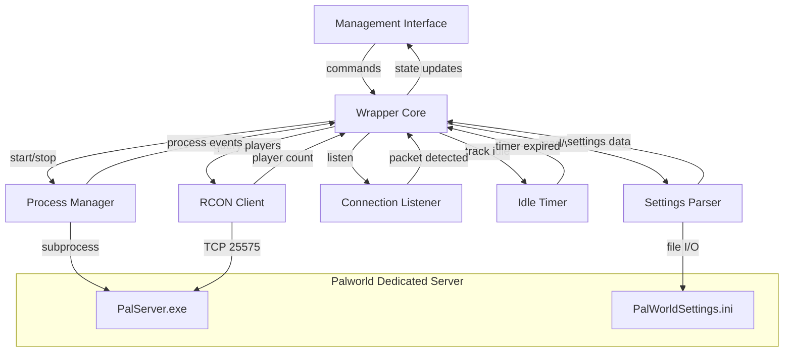

# Design Document: Palworld Server Wrapper

## Overview

The Palworld Server Wrapper is a lightweight Python application for Windows that manages the lifecycle of a Palworld Dedicated Server process. It provides two core automation behaviors — automatic shutdown when idle and automatic startup on connection attempt — along with a management interface for manual server control and settings management.

The wrapper operates as a state machine with three primary states: **Monitoring** (server stopped, listening for UDP connections), **Running** (server active, polling players via RCON), and **Transitioning** (server starting or stopping). The architecture uses Python's `asyncio` event loop to handle concurrent operations (UDP monitoring, RCON polling, idle timing, management interface) within a single process using minimal threads.

### Key Design Decisions

1. **asyncio over threading**: Using `asyncio` keeps resource usage low and avoids thread synchronization complexity. The wrapper needs to handle I/O-bound tasks (UDP listening, TCP RCON queries, user input) which are well-suited to async patterns.
2. **Source RCON protocol**: Palworld uses Valve's Source RCON protocol over TCP (default port 25575). The `ShowPlayers` command returns connected player information. We'll use the `rcon` PyPI package for the protocol implementation.
3. **UDP sniffing via socket binding**: The Connection Listener binds to UDP port 8211. When a packet arrives, it indicates a player is trying to connect. The listener releases the port before starting the server so the Dedicated Server can bind to it.
4. **INI file parsing**: Palworld's `PalWorldSettings.ini` uses a single-line `OptionSettings=(key=value,key=value,...)` format under a `[/Script/Pal.PalGameWorldSettings]` section header. A custom parser handles this non-standard format.

## Architecture



### Component Interaction Diagram



## Components and Interfaces

### 1. Wrapper Core (`wrapper_core.py`)

The central coordinator that manages state transitions and orchestrates all other components.

```python
class ServerState(Enum):
    MONITORING = "monitoring"      # Server stopped, listening for connections
    STARTING = "starting"          # Server process launched, waiting for ready
    RUNNING = "running"            # Server active, monitoring players
    STOPPING = "stopping"          # Graceful shutdown in progress

class WrapperCore:
    state: ServerState
    player_count: int
    idle_seconds: int
    
    async def run() -> None
    async def handle_connection_detected() -> None
    async def handle_idle_expired() -> None
    async def handle_server_crashed() -> None
    async def start_server() -> StartResult
    async def stop_server() -> StopResult
    async def restart_server() -> RestartResult
    def get_status() -> WrapperStatus
```

### 2. Connection Listener (`connection_listener.py`)

Binds to UDP port 8211 and detects incoming packets when the server is not running.

```python
class ConnectionListener:
    async def start_listening() -> None
    async def stop_listening() -> None
    def is_listening() -> bool
```

- Uses `asyncio` UDP protocol (`loop.create_datagram_endpoint`)
- Calls back into WrapperCore when a packet is received
- Releases the socket within 1 second when instructed to stop

### 3. Process Manager (`process_manager.py`)

Handles starting and stopping the Dedicated Server process.

```python
@dataclass
class StartResult:
    success: bool
    error_message: str | None = None

@dataclass
class StopResult:
    success: bool
    was_forced: bool = False
    error_message: str | None = None

class ProcessManager:
    async def start_server(exe_path: str, args: list[str]) -> StartResult
    async def stop_server(timeout: int = 30) -> StopResult
    async def is_running() -> bool
    async def wait_for_port(port: int, timeout: int = 120) -> bool
    def get_pid() -> int | None
```

- Launches `PalServer.exe` via `asyncio.create_subprocess_exec`
- Polls port 8211 readiness using socket connect attempts
- Graceful shutdown via `process.terminate()` (sends CTRL_BREAK_EVENT on Windows)
- Forced kill via `process.kill()` after timeout
- Monitors for unexpected process termination via `process.wait()`

### 4. RCON Client (`rcon_client.py`)

Queries the server for connected player count using the Source RCON protocol.

```python
@dataclass
class RconQueryResult:
    success: bool
    player_count: int = 0
    error_message: str | None = None

class RconClient:
    async def connect(host: str, port: int, password: str) -> bool
    async def query_players() -> RconQueryResult
    async def disconnect() -> None
```

- Connects to RCON port (default 25575) using `rcon` library
- Issues `ShowPlayers` command and parses the response to count players
- `ShowPlayers` returns CSV-like output: `name,playeruid,steamid\n` per player
- Player count = number of non-empty lines in response (excluding header if present)
- Handles connection failures gracefully, returning error results

### 5. Idle Timer (`idle_timer.py`)

Tracks elapsed time with zero connected players and fires a callback when the threshold is reached.

```python
class IdleTimer:
    async def start() -> None
    def reset() -> None
    def cancel() -> None
    def is_active() -> bool
    def elapsed_seconds() -> int
```

- Uses `asyncio.get_event_loop().time()` for monotonic timing
- Fires callback at 600 seconds
- Resets when player connects, cancels when server stops

### 6. Settings Parser (`settings_parser.py`)

Reads and writes the `PalWorldSettings.ini` file.

```python
@dataclass
class SettingDefinition:
    name: str
    value_type: type      # int, float, str, bool
    min_value: Any = None
    max_value: Any = None
    allowed_values: list[Any] | None = None

@dataclass
class ValidationResult:
    valid: bool
    error_message: str | None = None

class SettingsParser:
    def read_settings(file_path: Path) -> dict[str, Any]
    def write_setting(file_path: Path, key: str, value: Any) -> None
    def validate_setting(key: str, value: Any) -> ValidationResult
    def get_setting_definitions() -> dict[str, SettingDefinition]
```

- Parses the `OptionSettings=(...)` single-line format
- Validates values against known setting definitions (type, range)
- Preserves file structure when writing changes (only modifies the target value)
- File path: `<SteamDir>/steamapps/common/PalServer/Pal/Saved/Config/WindowsServer/PalWorldSettings.ini`

### 7. Management Interface (`management_interface.py`)

Provides a local CLI-based interface for user interaction.

```python
class ManagementInterface:
    async def run() -> None
    async def display_status(status: WrapperStatus) -> None
    async def prompt_command() -> str
    async def display_message(message: str) -> None
```

- Runs on the asyncio event loop using `aioconsole` or `asyncio` stdin reader
- Displays: server status, player count, idle timer
- Commands: `start`, `stop`, `restart`, `status`, `settings`, `set <key> <value>`, `quit`
- Non-blocking — can accept input while server operations are in progress

### 8. Logger (`logger.py`)

Centralized logging with file rotation.

```python
class WrapperLogger:
    def setup(log_path: Path, max_size_mb: int = 10, backup_count: int = 3) -> None
    def log_state_transition(from_state: str, to_state: str) -> None
    def log_player_event(event_type: str, count: int) -> None
    def log_error(context: str, error: Exception) -> None
```

- Uses Python's `logging` module with `RotatingFileHandler`
- Max 10 MB per log file, 3 backup files retained
- All entries include ISO 8601 timestamps

## Data Models

### Configuration (`config.py`)

```python
@dataclass
class WrapperConfig:
    # Server paths
    server_exe_path: Path          # Path to PalServer.exe
    settings_file_path: Path       # Path to PalWorldSettings.ini
    
    # Network
    game_port: int = 8211          # UDP port for game connections
    rcon_port: int = 25575         # TCP port for RCON
    rcon_password: str = ""        # RCON admin password
    
    # Timing
    idle_timeout_seconds: int = 600       # Seconds before idle shutdown
    start_timeout_seconds: int = 120      # Max wait for server startup
    stop_timeout_seconds: int = 30        # Max wait for graceful shutdown
    rcon_poll_interval_seconds: int = 10  # Seconds between RCON queries
    
    # Logging
    log_file_path: Path = Path("wrapper.log")
    log_max_size_mb: int = 10
    log_backup_count: int = 3
```

### Wrapper Status

```python
@dataclass
class WrapperStatus:
    server_state: ServerState
    player_count: int
    idle_timer_active: bool
    idle_seconds: int
    server_pid: int | None
    uptime_seconds: int | None
```

### State Transition Events

```python
@dataclass
class StateTransitionEvent:
    timestamp: datetime
    from_state: ServerState
    to_state: ServerState
    reason: str
```


## Correctness Properties

*A property is a characteristic or behavior that should hold true across all valid executions of a system — essentially, a formal statement about what the system should do. Properties serve as the bridge between human-readable specifications and machine-verifiable correctness guarantees.*

### Property 1: Idle Timer Lifecycle Invariant

*For any* server state and player count, the idle timer SHALL be active if and only if the server is in the RUNNING state and the connected player count is zero. When the player count transitions from zero to a positive number, the timer resets. When the server leaves the RUNNING state, the timer is cancelled.

**Validates: Requirements 1.1, 1.3, 1.6**

### Property 2: Idle Shutdown Threshold

*For any* idle timer state where elapsed seconds >= 600 and player count == 0, the wrapper SHALL trigger a server shutdown. For any elapsed seconds < 600, the wrapper SHALL NOT trigger a shutdown.

**Validates: Requirements 1.2**

### Property 3: Connection Listener State Invariant

*For any* wrapper state, the connection listener SHALL be actively monitoring UDP port 8211 if and only if the server state is MONITORING (server stopped and no start attempt in progress).

**Validates: Requirements 2.1**

### Property 4: Single Start Attempt Idempotence

*For any* sequence of N UDP packets received while the server is not running, the wrapper SHALL initiate exactly one start attempt. Additional packets received during the start attempt SHALL be discarded without initiating additional start attempts.

**Validates: Requirements 2.2**

### Property 5: Command Guard Conditions

*For any* management command issued in an incompatible state, the wrapper SHALL reject the command with an informative message and leave the state unchanged. Specifically: a start command while RUNNING returns "already running", and a stop command while not RUNNING returns "not running".

**Validates: Requirements 3.4, 3.5**

### Property 6: Settings Validation

*For any* setting key and value, the settings validator SHALL accept the value if and only if it matches the expected type and falls within the acceptable range for that setting. Invalid values SHALL be rejected with an error message, and the configuration file SHALL remain unchanged.

**Validates: Requirements 4.2, 4.3**

### Property 7: Settings Round-Trip Preservation

*For any* valid `PalWorldSettings.ini` content and any valid setting modification, writing the modified value and then reading the file back SHALL produce a settings dictionary that matches the original except for the modified key, which SHALL have the new value.

**Validates: Requirements 4.2**

### Property 8: Malformed Configuration Graceful Handling

*For any* string that does not conform to the expected `OptionSettings=(...)` format, the settings parser SHALL return an error result rather than crashing or producing incorrect data.

**Validates: Requirements 4.6**

### Property 9: Player Count Tracks RCON Response

*For any* successful RCON query result, the wrapper's stored player count SHALL be updated to match the RCON-reported count. If the new count is higher, a connection event is logged. If lower, a disconnection event is logged.

**Validates: Requirements 5.2, 5.3**

### Property 10: Player Count Non-Negative Invariant

*For any* sequence of RCON responses (including erroneous or unexpected values), the wrapper's stored player count SHALL never be less than zero.

**Validates: Requirements 5.4**

### Property 11: RCON Failure Preserves Count

*For any* RCON query failure, the wrapper SHALL retain the previously stored player count without modification.

**Validates: Requirements 5.6**

### Property 12: Poll Interval Bounds

*For any* configured RCON poll interval value, the wrapper SHALL reject values less than 1 second or greater than 30 seconds during configuration validation.

**Validates: Requirements 7.3**

### Property 13: Start Error Recovery

*For any* error encountered during server startup, the wrapper SHALL transition to (or remain in) the MONITORING state and resume listening for connections.

**Validates: Requirements 8.2**

### Property 14: State Transitions Produce Log Entries

*For any* state transition event (server started, stopped, crashed, player connected/disconnected, idle timer started/expired, or error), the wrapper SHALL produce a log entry containing an ISO 8601 timestamp and a description of the event.

**Validates: Requirements 8.4**

## Error Handling

### Error Categories and Responses

| Error Category | Example | Response | State After |
|---|---|---|---|
| Server start failure | `PalServer.exe` not found, port conflict | Log error, inform user | MONITORING |
| Server stop timeout | Process doesn't terminate in 30s | Force kill, log warning | MONITORING |
| Server crash | Process terminates unexpectedly | Log event, resume monitoring | MONITORING |
| RCON connection failure | TCP connection refused | Retain last count, retry next interval | RUNNING (unchanged) |
| RCON consecutive failures | 5+ failures in a row | Log warning, continue retrying | RUNNING (unchanged) |
| Settings file not found | Path doesn't exist | Log error, inform user | Unchanged |
| Settings file malformed | Can't parse INI format | Log error, inform user | Unchanged |
| Settings validation failure | Value out of range | Reject change, inform user | Unchanged |
| Force kill failure | Process survives kill signal | Log critical, resume monitoring | MONITORING |
| Unhandled exception | Any unexpected error | Log exception, continue running | Unchanged |

### Error Propagation Strategy

1. **Component-level errors** are caught at the component boundary and returned as result objects (`StartResult`, `StopResult`, `RconQueryResult`, `ValidationResult`).
2. **Core-level errors** are caught in the `WrapperCore` event loop and logged. The wrapper never terminates due to an error in its own operation.
3. **Fatal conditions** (e.g., cannot bind to UDP port on initial startup) are logged and reported to the user but do not crash the wrapper.

### Graceful Degradation

- If RCON becomes permanently unavailable, the wrapper continues running but cannot track player count. The idle timer will not start because player count remains at its last known value.
- If the management interface encounters an I/O error, it logs the error and attempts to continue accepting input.

## Testing Strategy

### Property-Based Testing

**Library**: [Hypothesis](https://hypothesis.readthedocs.io/) (Python's standard PBT framework)

**Configuration**: Minimum 100 iterations per property test, using `@settings(max_examples=100)`.

**Tag format**: Each property test includes a comment referencing the design property:
```python
# Feature: palworld-server-wrapper, Property 1: Idle Timer Lifecycle Invariant
```

**Key property tests**:
- Idle timer lifecycle (Properties 1, 2): Generate random sequences of player count changes and time advances, verify timer behavior
- Settings validation (Property 6): Generate random values for each setting type, verify accept/reject
- Settings round-trip (Property 7): Generate valid settings dictionaries, write then read, verify preservation
- Malformed config handling (Property 8): Generate random strings, verify parser returns errors gracefully
- Player count tracking (Properties 9, 10, 11): Generate sequences of RCON responses (including failures), verify count tracking and non-negative invariant
- State machine properties (Properties 3, 4, 5, 13): Generate random event sequences, verify state invariants hold

### Unit Tests

Focus areas for example-based unit tests:
- **Process Manager**: Mock `subprocess` calls, verify start/stop/force-kill sequences
- **RCON Client**: Mock TCP socket, verify `ShowPlayers` response parsing (header handling, empty response, multiple players)
- **Management Interface**: Verify command parsing and response formatting
- **Logger**: Verify log rotation configuration and entry format
- **Edge cases**: Empty settings file, server already running on start, server already stopped on stop

### Integration Tests

- Full lifecycle test: start server → verify RCON → idle timeout → verify shutdown → receive UDP → verify restart
- Crash recovery test: start server → kill process → verify wrapper detects and resumes monitoring
- Settings modification test: read settings → modify → read back → verify change persisted

### Test Organization

```
tests/
├── property/
│   ├── test_idle_timer_properties.py
│   ├── test_settings_properties.py
│   ├── test_player_count_properties.py
│   └── test_state_machine_properties.py
├── unit/
│   ├── test_process_manager.py
│   ├── test_rcon_client.py
│   ├── test_connection_listener.py
│   ├── test_settings_parser.py
│   ├── test_management_interface.py
│   └── test_logger.py
└── integration/
    ├── test_lifecycle.py
    └── test_crash_recovery.py
```

### Dependencies

- **Runtime**: `rcon` (Source RCON protocol), `asyncio` (stdlib)
- **Testing**: `pytest`, `pytest-asyncio`, `hypothesis`
- **Python version**: 3.11+ (for modern asyncio features and `tomllib`)
