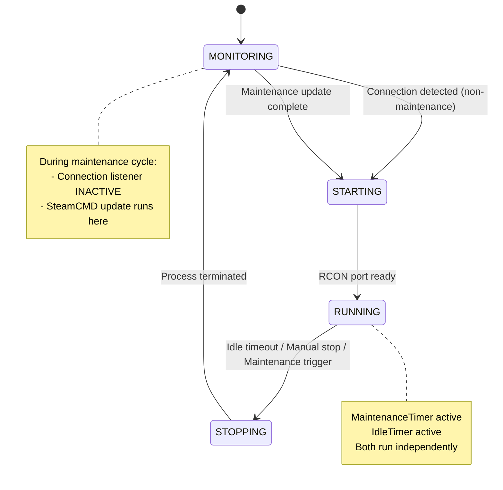
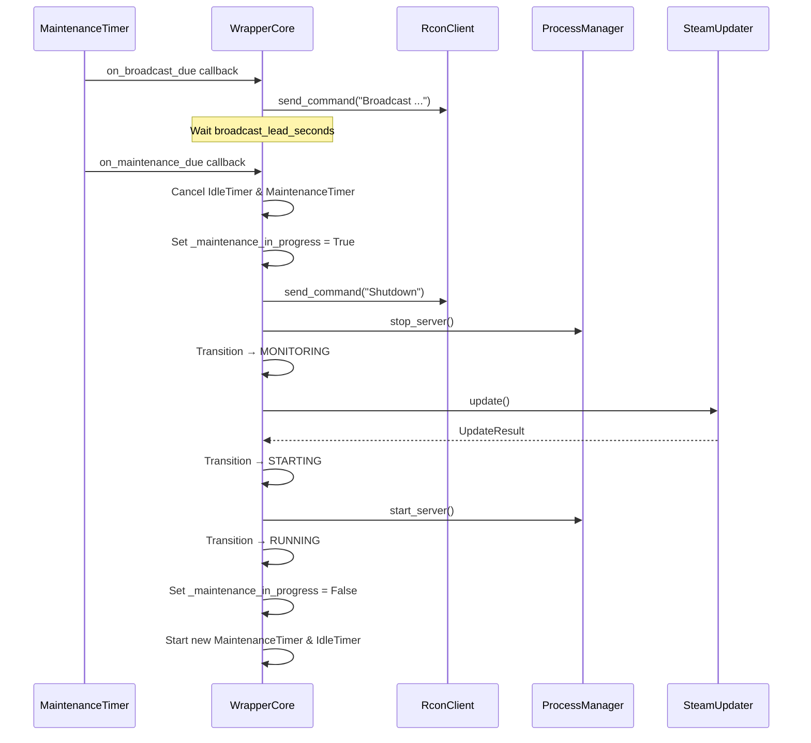

# Design Document: Regular Server Maintenance

## Overview

This feature adds a scheduled maintenance cycle to the Palworld Server Wrapper that automatically restarts the server at configurable intervals. The maintenance cycle broadcasts a warning to connected players, gracefully stops the server, runs a SteamCMD update to keep the Palworld Dedicated Server software current, and restarts the server — all without operator intervention.

The design integrates a new `MaintenanceTimer` component and a `MaintenanceCycle` orchestrator into the existing `WrapperCore` state machine. The timer follows the same asyncio-based pattern as the existing `IdleTimer`, using callbacks to notify `WrapperCore` when a maintenance window is due. A `SteamUpdater` component encapsulates the SteamCMD subprocess interaction.

## Architecture

The maintenance feature threads into the existing state machine without adding new states. The wrapper transitions through the existing `RUNNING → STOPPING → MONITORING → STARTING → RUNNING` path during each maintenance cycle. A `_maintenance_in_progress` flag on `WrapperCore` distinguishes a maintenance-driven stop/start from other transitions, allowing the connection listener to stay inactive during the MONITORING phase of a maintenance cycle.



### Component Interaction During Maintenance Cycle



## Components and Interfaces

### New Components

#### MaintenanceTimer (`src/maintenance_timer.py`)

A countdown timer that tracks elapsed uptime in the RUNNING state and fires callbacks at two points: when the broadcast should be sent, and when the maintenance cycle should begin.

```python
class MaintenanceTimer:
    def __init__(
        self,
        interval_seconds: int,
        broadcast_lead_seconds: int,
        on_broadcast_due: Callable[[], Coroutine[Any, Any, None]],
        on_maintenance_due: Callable[[], Coroutine[Any, Any, None]],
    ) -> None: ...

    async def start(self) -> None: ...
    def cancel(self) -> None: ...
    def is_active(self) -> bool: ...
    def elapsed_seconds(self) -> int: ...
```

**Design decisions:**
- Two callbacks rather than one: separating the broadcast trigger from the maintenance trigger keeps the timer logic decoupled from RCON communication and allows the timer to proceed regardless of broadcast success.
- Follows the same `asyncio.Task` + `asyncio.sleep` pattern as `IdleTimer` for consistency.
- `start()` always resets to zero — no accumulated time carries over between RUNNING sessions.

#### SteamUpdater (`src/steam_updater.py`)

Encapsulates the SteamCMD invocation for updating the Palworld Dedicated Server.

```python
@dataclass
class UpdateResult:
    success: bool
    skipped: bool = False
    error_message: str | None = None
    timed_out: bool = False

class SteamUpdater:
    def __init__(
        self,
        steamcmd_path: str,
        install_dir: str,
        app_id: int = 2394010,
        timeout_seconds: int = 300,
    ) -> None: ...

    async def update(self) -> UpdateResult: ...
```

**Design decisions:**
- Separate class rather than inline in WrapperCore: keeps subprocess management isolated and testable.
- Returns `UpdateResult` dataclass consistent with the project's result-type-over-exceptions pattern.
- Validates paths before invoking subprocess — returns `skipped=True` if paths are missing or invalid.
- Hard-coded app ID 2394010 (Palworld Dedicated Server) with configurable override for testing.
- 300-second timeout with process termination on expiry.

### Modified Components

#### WrapperConfig (`src/config.py`)

New fields added:

```python
# Maintenance
maintenance_interval_seconds: int = 21600  # 6 hours (range: 3600–86400)
maintenance_broadcast_lead_seconds: int = 300  # 5 minutes (range: 30–1800)
steamcmd_path: str = ""  # Path to steamcmd.exe
steam_app_install_dir: str = ""  # Palworld Dedicated Server install dir
```

Validation added to `validate()`:
- `maintenance_interval_seconds` must be an integer in [3600, 86400]
- `maintenance_broadcast_lead_seconds` must be an integer in [30, 1800]
- `maintenance_broadcast_lead_seconds` must be strictly less than `maintenance_interval_seconds`

#### WrapperCore (`src/wrapper_core.py`)

New instance attributes:
- `_maintenance_timer: MaintenanceTimer`
- `_steam_updater: SteamUpdater`
- `_maintenance_in_progress: bool = False`

New methods:
- `async def _handle_broadcast_due(self) -> None` — Sends broadcast via RCON if players are connected
- `async def _handle_maintenance_due(self) -> None` — Orchestrates the full maintenance cycle
- `async def _run_maintenance_cycle(self) -> None` — Stop → Update → Start sequence

Modified methods:
- `_enter_running_state()` — Also starts the `MaintenanceTimer`
- `handle_idle_expired()` — Checks `_maintenance_in_progress`; if a broadcast phase is underway, suppresses idle shutdown
- `handle_connection_detected()` — Ignores connections when `_maintenance_in_progress` is True
- `stop_server()` — Cancels `MaintenanceTimer` alongside idle timer
- `_cleanup()` — Cancels `MaintenanceTimer`

#### ConnectionListener (`src/connection_listener.py`)

No changes needed. The wrapper simply does not call `start_listening()` during the MONITORING phase of a maintenance cycle. The `_maintenance_in_progress` flag in WrapperCore controls this.

## Data Models

### New Dataclasses

```python
@dataclass
class UpdateResult:
    """Result of a SteamCMD update attempt."""
    success: bool
    skipped: bool = False
    error_message: str | None = None
    timed_out: bool = False

@dataclass
class MaintenanceCycleResult:
    """Result of a complete maintenance cycle."""
    success: bool
    update_result: UpdateResult | None = None
    duration_seconds: float = 0.0
    error_message: str | None = None
```

### Configuration Validation Rules

| Field | Type | Default | Min | Max | Cross-validation |
|-------|------|---------|-----|-----|-----------------|
| `maintenance_interval_seconds` | int | 21600 | 3600 | 86400 | — |
| `maintenance_broadcast_lead_seconds` | int | 300 | 30 | 1800 | Must be < `maintenance_interval_seconds` |
| `steamcmd_path` | str | "" | — | — | Validated at runtime (skip if empty/not found) |
| `steam_app_install_dir` | str | "" | — | — | Validated at runtime (skip if empty/not found) |


## Correctness Properties

*A property is a characteristic or behavior that should hold true across all valid executions of a system — essentially, a formal statement about what the system should do. Properties serve as the bridge between human-readable specifications and machine-verifiable correctness guarantees.*

### Property 1: Maintenance interval out-of-range rejection

*For any* integer value outside the range [3600, 86400], calling `validate()` on a `WrapperConfig` with that value as `maintenance_interval_seconds` SHALL raise a `ValueError`.

**Validates: Requirements 1.2, 1.3**

### Property 2: Maintenance interval type rejection

*For any* value that is not an integer (floats, strings, None, lists, dicts), setting `maintenance_interval_seconds` to that value and calling `validate()` SHALL raise a validation error indicating the expected type.

**Validates: Requirements 1.5**

### Property 3: Broadcast lead time out-of-range rejection

*For any* integer value outside the range [30, 1800], calling `validate()` on a `WrapperConfig` with that value as `maintenance_broadcast_lead_seconds` SHALL raise a `ValueError`.

**Validates: Requirements 3.2, 3.3**

### Property 4: Broadcast lead time must be less than maintenance interval

*For any* pair of integers `(interval, broadcast_lead)` where both are individually within their valid ranges BUT `broadcast_lead >= interval`, calling `validate()` SHALL raise a `ValueError`.

**Validates: Requirements 3.4**

### Property 5: Maintenance timer inactive in non-RUNNING states

*For any* server state in {MONITORING, STARTING, STOPPING}, the `MaintenanceTimer` SHALL report `is_active()` as False and `elapsed_seconds()` as 0. Additionally, *for any* transition from RUNNING to another state, the timer SHALL be cancelled and reset to zero.

**Validates: Requirements 2.1, 2.2, 2.4**

### Property 6: Maintenance cycle state transition sequence

*For any* maintenance cycle execution, the wrapper SHALL transition through exactly the state sequence [RUNNING, STOPPING, MONITORING, STARTING, RUNNING], with no states skipped or reordered.

**Validates: Requirements 4.5**

### Property 7: Connection listener inactive during maintenance MONITORING

*For any* maintenance cycle, while the wrapper is in the MONITORING state between stop and start, connection detection events SHALL be ignored and the connection listener SHALL not be started.

**Validates: Requirements 4.6**

### Property 8: Idle timer non-interference

*For any* sequence of player connect/disconnect events while the maintenance timer is active, the idle timer SHALL start, cancel, and reset identically to how it would behave without the maintenance timer present — the maintenance timer does not pause, suppress, or modify idle timer behavior.

**Validates: Requirements 6.1**

### Property 9: Timer reset after maintenance cycle

*For any* completed maintenance cycle where the server returns to the RUNNING state, the maintenance timer SHALL report `elapsed_seconds()` as 0 (starting fresh for the next cycle) AND the idle timer SHALL be active (since no players are connected on a fresh start).

**Validates: Requirements 6.4**

## Error Handling

### SteamCMD Failures

The update step is designed to be non-blocking. All SteamCMD failure modes (non-zero exit, timeout, missing executable, missing install dir) result in a logged warning and the maintenance cycle continues to the server start phase. The server should never remain stopped due to an update failure.

| Failure Mode | Action |
|---|---|
| `steamcmd_path` empty or not found | Skip update, log WARNING, proceed to start |
| `steam_app_install_dir` empty or not found | Skip update, log WARNING, proceed to start |
| SteamCMD non-zero exit code | Log WARNING with exit code, proceed to start |
| SteamCMD timeout (>300s) | Terminate SteamCMD process, log WARNING, proceed to start |

### RCON Broadcast Failures

If the RCON broadcast message fails to send (connection lost, timeout, server not responding), the wrapper logs a WARNING and continues. The maintenance cycle still waits the full `broadcast_lead_seconds` before stopping — this gives players time even if they didn't receive the in-game message (they may see the server closing in other ways).

### Server Stop Failures

If both the graceful RCON Shutdown and the process tree kill fail (unlikely but possible), the wrapper logs a WARNING and proceeds to the update step. This is consistent with the design principle that the maintenance cycle should always attempt to complete and restart the server.

### Timer Re-entrance Guard

If the maintenance timer somehow fires while a cycle is already in progress (should not happen since the timer is cancelled at cycle start, but as a defensive measure), the `_maintenance_in_progress` flag prevents a second cycle from starting. The spurious timer fire is logged and discarded.

### Idle Timer Conflict During Broadcast Phase

During the broadcast lead time (between broadcast send and actual shutdown), the idle timer might expire if players disconnect. The `_maintenance_in_progress` flag suppresses the idle shutdown — the maintenance cycle takes priority since it's already committed to restarting.

## Testing Strategy

### Unit Tests (`tests/unit/test_maintenance_timer.py`)

- Default configuration values for new fields
- Validation error on out-of-range `maintenance_interval_seconds`
- Validation error on out-of-range `maintenance_broadcast_lead_seconds`
- Validation error on `broadcast_lead >= interval`
- `MaintenanceTimer.start()` sets `is_active()` to True
- `MaintenanceTimer.cancel()` sets `is_active()` to False and `elapsed_seconds()` to 0
- Callback invocation at correct timing (mocked `asyncio.sleep`)
- Broadcast callback fires before maintenance callback

### Unit Tests (`tests/unit/test_steam_updater.py`)

- Returns `skipped=True` when `steamcmd_path` is empty
- Returns `skipped=True` when `steam_app_install_dir` is empty
- Returns `skipped=True` when executable path doesn't exist
- Returns `success=True` on exit code 0
- Returns `success=False` on non-zero exit code
- Returns `timed_out=True` and terminates process after 300s
- Correct command-line arguments passed to subprocess

### Unit Tests (`tests/unit/test_maintenance_cycle.py`)

- Full cycle state transitions: RUNNING → STOPPING → MONITORING → STARTING → RUNNING
- Connection listener not started during maintenance MONITORING
- Idle timer cancelled at cycle start
- Maintenance timer cancelled at cycle start
- Both timers restarted after cycle completes
- Broadcast skipped when player count is 0
- Broadcast sent when players connected
- Cycle proceeds when broadcast fails
- Cycle proceeds when stop fails
- Cycle proceeds when update fails/skipped
- `_maintenance_in_progress` prevents re-entrant cycle
- Idle expiry suppressed during broadcast phase
- Logging at correct levels for each phase

### Property-Based Tests (`tests/property/test_maintenance_properties.py`)

Each property test uses `hypothesis` with `@settings(max_examples=100)` minimum.

- **Property 1**: Generate random integers outside [3600, 86400], verify validation raises ValueError
  - Tag: `Feature: regular-server-maintenance, Property 1: maintenance interval out-of-range rejection`
- **Property 2**: Generate non-integer values (floats, strings, None), verify type validation error
  - Tag: `Feature: regular-server-maintenance, Property 2: maintenance interval type rejection`
- **Property 3**: Generate random integers outside [30, 1800], verify validation raises ValueError
  - Tag: `Feature: regular-server-maintenance, Property 3: broadcast lead time out-of-range rejection`
- **Property 4**: Generate valid (interval, broadcast_lead) pairs where broadcast_lead >= interval, verify ValueError
  - Tag: `Feature: regular-server-maintenance, Property 4: broadcast lead time must be less than maintenance interval`
- **Property 5**: Test timer state across non-RUNNING states, verify inactive invariant
  - Tag: `Feature: regular-server-maintenance, Property 5: maintenance timer inactive in non-RUNNING states`
- **Property 6**: Execute maintenance cycle with randomized timing, verify state sequence
  - Tag: `Feature: regular-server-maintenance, Property 6: maintenance cycle state transition sequence`
- **Property 7**: During maintenance MONITORING, simulate connection events, verify ignored
  - Tag: `Feature: regular-server-maintenance, Property 7: connection listener inactive during maintenance MONITORING`
- **Property 8**: Generate random player connect/disconnect sequences, verify idle timer behaves identically with and without maintenance timer
  - Tag: `Feature: regular-server-maintenance, Property 8: idle timer non-interference`
- **Property 9**: Complete maintenance cycle, verify both timers in correct initial state
  - Tag: `Feature: regular-server-maintenance, Property 9: timer reset after maintenance cycle`

### Test Configuration

- Property-based testing library: **hypothesis** (already in project)
- Minimum iterations: 100 per property (`@settings(max_examples=100)`)
- Use `deadline=None` for async tests with mocked `asyncio.sleep`
- Mock boundaries: `ProcessManager`, `RconClient`, `asyncio.create_subprocess_exec`
- Use `AsyncMock` for all component interactions in unit tests
