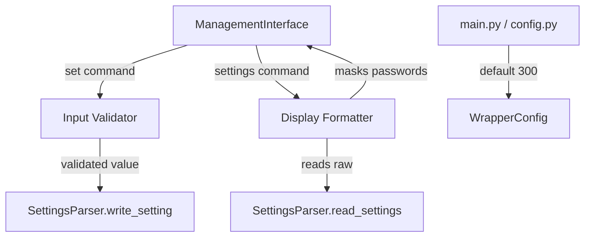

# Design Document: Server Settings Improvements

## Overview

This design covers three improvements to the server settings subsystem:

1. **Reduced default idle timeout** — Change from 600s to 300s in `WrapperConfig`, `main.py` argparse, and documentation.
2. **Password censoring in settings output** — The `settings` command masks any setting whose key contains "Password" with `********`, while the parser continues to store/read the real value.
3. **Input validation with auto-correction for `set` command** — The `_cmd_set` method validates and normalizes user input before delegating to `SettingsParser.write_setting`, providing clear feedback when values are auto-corrected or rejected.

All changes follow the existing architecture: single-process asyncio, result types over exceptions, callbacks between components.

## Architecture

The changes are localized to three layers:



- **main.py / config.py** — Default value change only.
- **ManagementInterface** — New display formatting logic in `_cmd_settings` and new validation/auto-correction logic in `_cmd_set`.
- **SettingsParser** — Updated `_format_value` to properly quote string values, and `_coerce_value` to strip quotes on read.

No new modules are introduced. The validation and auto-correction logic lives in `ManagementInterface._cmd_set` because it is a presentation-layer concern (user input normalization and feedback), while `SettingsParser` remains the pure read/write/validate layer.

## Components and Interfaces

### 1. WrapperConfig (src/config.py)

**Change:** Update default value of `idle_timeout_seconds` from `600` to `300`.

No interface changes — the field type and validation remain the same.

### 2. CLI Argument Parser (src/main.py)

**Change:** Update the `--idle-timeout` argument's `default` from `600` to `300` and update the help string accordingly.

### 3. ManagementInterface._cmd_settings (src/management_interface.py)

**New behavior:** Before displaying a setting's value, check if the key contains the substring `"Password"` (case-sensitive). If so, display `********` instead of the actual value.

```python
PASSWORD_MASK = "********"

def _is_password_setting(self, key: str) -> bool:
    """Check if a setting key is a password field."""
    return "Password" in key
```

### 4. ManagementInterface._cmd_set (src/management_interface.py)

**New behavior:** Before passing the value to `SettingsParser.write_setting`, apply type-aware validation and auto-correction:

```python
async def _cmd_set(self, parts: list[str]) -> None:
    # 1. Look up SettingDefinition for the key
    # 2. If unknown setting: write as-is (no validation)
    # 3. If known setting:
    #    a. Validate/auto-correct based on value_type
    #    b. On validation failure: display error, return
    #    c. On auto-correction: display original + corrected
    # 4. Delegate to SettingsParser.write_setting with corrected value
```

**Auto-correction rules:**

| Value Type | Input | Action |
|-----------|-------|--------|
| `str` | No surrounding `"` | Wrap in `"..."` |
| `str` | Already has `"..."` | Strip outer quotes, pass inner content |
| `bool` | Any casing of true/false | Normalize to `True`/`False` |
| `int` | Valid integer in range | Pass as `int` |
| `float` | Valid float in range | Pass as `float` (parser formats to 6 decimals) |
| `enum` (str with allowed_values) | Matches allowed list | Pass as-is |

**Rejection rules:**

| Condition | Action |
|-----------|--------|
| Non-numeric for int/float | Error: expected type |
| Out-of-range int/float | Error: allowed range [min, max] |
| Invalid enum value | Error: list all allowed values |
| Non-boolean for bool | Error: expected True/False |

### 5. SettingsParser._format_value (src/settings_parser.py)

**Change:** When `definition.value_type == str`, wrap the value in double quotation marks:

```python
elif definition.value_type == str:
    return f'"{value}"'
```

### 6. SettingsParser._coerce_value (src/settings_parser.py)

**Change:** When `definition.value_type == str`, strip surrounding double quotes if present:

```python
else:
    # String type: strip surrounding quotes if present
    if raw_value.startswith('"') and raw_value.endswith('"'):
        return raw_value[1:-1]
    return raw_value
```

## Data Models

### Existing Models (unchanged)

- **`ValidationResult`** — `dataclass(valid: bool, error_message: str | None)` — already used by `SettingsParser.validate_setting` and `write_setting`.
- **`SettingDefinition`** — `dataclass(name, value_type, min_value, max_value, allowed_values)` — already defines all constraints.
- **`WrapperConfig`** — Only the default value of `idle_timeout_seconds` changes.

### New Types

No new data models are needed. The auto-correction result can be represented as a tuple `(corrected_value, was_corrected: bool)` internal to `_cmd_set`, or as a small helper:

```python
@dataclass
class CorrectionResult:
    """Result of input auto-correction for the set command."""
    value: Any           # The corrected value to write
    was_corrected: bool  # Whether auto-correction was applied
    original_input: str  # The user's original input string
```

This lives in `management_interface.py` as a private helper — it does not need to be in `models.py` since it's only used within the CLI layer.

## Correctness Properties

*A property is a characteristic or behavior that should hold true across all valid executions of a system — essentially, a formal statement about what the system should do. Properties serve as the bridge between human-readable specifications and machine-verifiable correctness guarantees.*

### Property 1: Password masking in display

*For any* setting whose key contains the substring "Password" (case-sensitive), and *for any* actual password value (including empty string), the settings command output SHALL display exactly `********` as the value for that setting.

**Validates: Requirements 2.1, 2.3, 2.5**

### Property 2: Non-password transparency in display

*For any* setting whose key does NOT contain the substring "Password", the settings command output SHALL display that setting's actual value unchanged.

**Validates: Requirements 2.2**

### Property 3: Password storage round-trip

*For any* password value (a string of 0–256 characters not containing double quotation marks), writing it to a password setting and reading it back via `SettingsParser` SHALL return the original unmasked value.

**Validates: Requirements 2.4, 4.4**

### Property 4: String quoting idempotence

*For any* string-type setting value provided by the user, after the set command's auto-correction logic runs, the value written to the file SHALL be enclosed in exactly one pair of double quotation marks — regardless of whether the input was already quoted or not.

**Validates: Requirements 3.1, 3.2, 4.1**

### Property 5: Boolean normalization

*For any* case variation of the strings "true" or "false" (e.g., "TRUE", "tRuE", "False"), the set command SHALL normalize the value to exactly "True" or "False" before writing, and the written file SHALL contain the canonical form.

**Validates: Requirements 3.3**

### Property 6: Invalid input rejection preserves file

*For any* known setting and *for any* value that fails validation (wrong type, out of range, or invalid enum value), the set command SHALL reject the input and the configuration file SHALL remain byte-for-byte identical to its state before the command was issued.

**Validates: Requirements 3.4, 3.6, 3.8, 3.9**

### Property 7: Valid numeric formatting

*For any* integer-type setting and *for any* valid integer within its defined [min_value, max_value] range, the written value in the file SHALL contain no decimal point. *For any* float-type setting and *for any* valid float within its defined range, the written value SHALL be formatted with exactly six decimal places.

**Validates: Requirements 3.5, 3.7**

### Property 8: Auto-correction feedback

*For any* set command invocation where the written value differs from the user's original input (due to quote wrapping, boolean normalization, or float formatting), the displayed success message SHALL contain both the original input and the corrected value.

**Validates: Requirements 3.12**

### Property 9: String setting write/read round-trip

*For any* string of up to 256 characters that does not contain double quotation marks, writing it as a string-type setting value and then reading it back SHALL produce a value equal to the original string.

**Validates: Requirements 4.2, 4.3, 4.4, 4.5**

### Property 10: CLI idle timeout passthrough

*For any* positive integer N ≥ 1, passing `--idle-timeout N` to the CLI argument parser SHALL produce a config where `idle_timeout_seconds == N`.

**Validates: Requirements 1.2**

## Error Handling

All error paths use the existing `ValidationResult` pattern — no exceptions for expected failures.

| Scenario | Handling |
|----------|----------|
| Settings file not found | `ValidationResult(valid=False, error_message="File not found: ...")` — displayed to user |
| Settings file unreadable | `ValidationResult(valid=False, error_message="Cannot read file: ...")` — displayed to user |
| Invalid type for known setting | Rejection message naming the expected type (e.g., "Setting 'ServerPlayerMaxNum' must be an integer") |
| Out-of-range numeric value | Rejection message with the allowed range (e.g., "must be between 1 and 32") |
| Invalid enum value | Rejection message listing all allowed values |
| Unknown setting key | No validation applied — write as-is (permissive for forward-compatibility) |
| `set` command wrong syntax | Usage hint: `"Usage: set <key> <value>"` |

The wrapper never crashes on settings errors. All paths log at `WARNING` level and return control to the command prompt.

## Testing Strategy

### Property-Based Tests (Hypothesis)

Each correctness property above maps to a property-based test using `hypothesis` with `@settings(max_examples=100)` minimum.

**Test file:** `tests/property/test_server_settings_improvements.py`

Tests will use:
- `hypothesis.strategies` for generating random strings, integers, floats, booleans
- `tmp_path` fixture for isolated file I/O
- Custom strategies for generating valid/invalid setting values based on `SettingDefinition`

**Tag format:** Each test includes a comment:
```python
# Feature: server-settings-improvements, Property N: <property text>
```

### Unit Tests

**Test file:** `tests/unit/test_settings_improvements.py`

| Test | Covers |
|------|--------|
| Default idle timeout is 300 | Req 1.1, 1.5 |
| CLI help text shows 300 | Req 1.5 |
| Password setting detection | Req 2.3 (specific examples) |
| Display masking with known passwords | Req 2.1 (specific examples) |
| Set command with valid enum | Req 3.10 |
| Set command with unknown key passthrough | Req 3.11 |
| Set command error message format for invalid int | Req 3.4 |
| Set command error message format for out-of-range | Req 3.6 |
| Auto-correction success message format | Req 3.12 |

### Integration Tests

Not required for this feature — all changes are within the wrapper process and don't involve external services.

### What's NOT Tested via PBT

- Documentation content (Req 1.3, 1.4) — verified by manual review or CI grep
- CLI help text wording (Req 1.5) — example-based unit test
- Exact error message wording — unit tests verify structure, not exact strings (per testing conventions)
