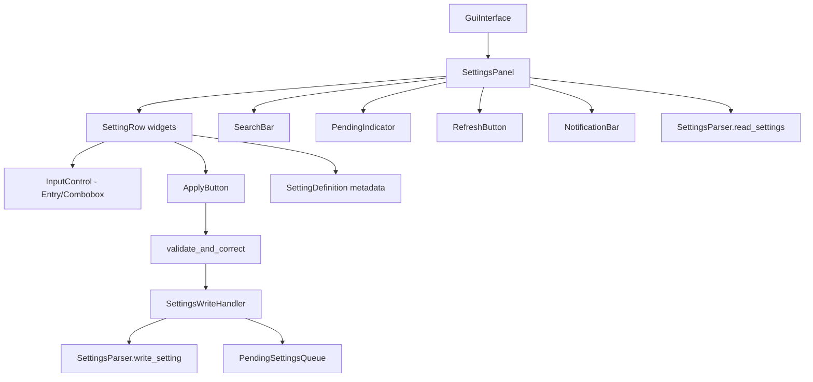
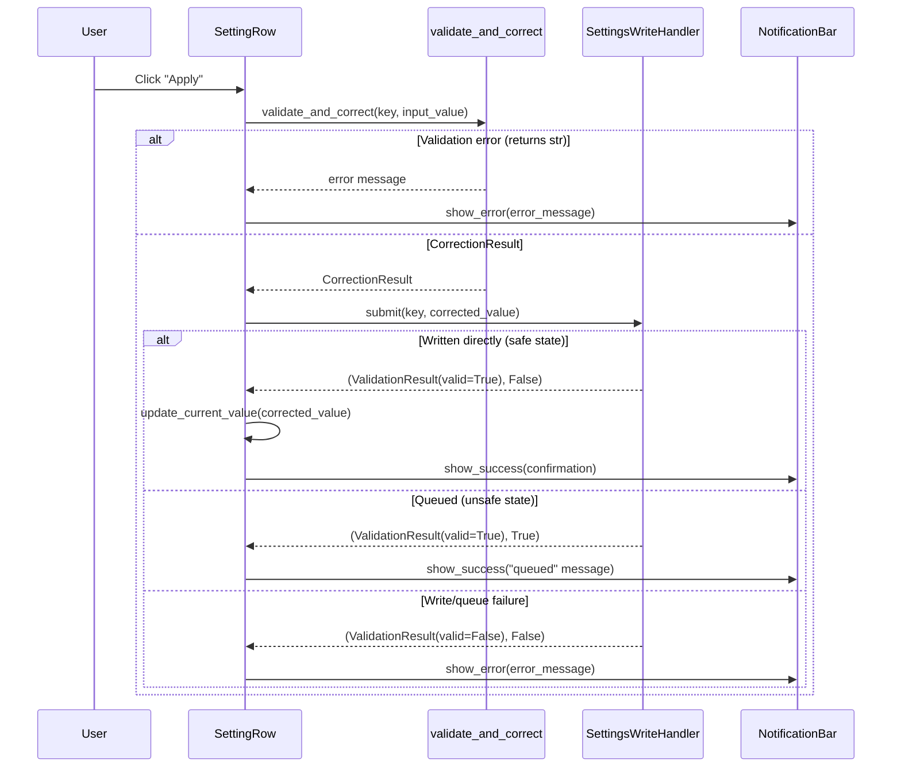

# Design Document: Server Settings Redesign

## Overview

This design consolidates the existing separate "Server Settings" (read-only `SettingsView`) and "Modify Setting" (`SettingsEditor`) panels into a single unified `SettingsPanel` that displays all setting metadata inline — description, allowed values, default value, current value, and an appropriate edit control — for each setting key. The redesign also extends the `SettingDefinition` dataclass with `description` and `default_value` fields, adds a search/filter capability, and integrates with the existing pending settings queue system.

The new panel replaces two existing ttk.LabelFrame subclasses with one scrollable, searchable interface where administrators can understand and modify settings without context switching or consulting external documentation.

## Architecture

### High-Level Component Interaction



### Integration with Existing Architecture

The `SettingsPanel` replaces both `SettingsView` and `SettingsEditor` in the `GuiInterface._build_ui()` layout. It:

1. Reads settings from disk via `SettingsParser.read_settings()`
2. Merges file keys with `SETTING_DEFINITIONS` keys to produce the full union
3. Renders one `SettingRow` per unique key (sorted alphabetically, case-insensitive)
4. Validates and writes via the existing `validate_and_correct()` → `SettingsWriteHandler.submit()` pipeline
5. Displays notifications via the existing `NotificationBar`

The cooperative async pattern is preserved — all GUI operations are synchronous tkinter calls triggered by user events or periodic refresh. No new async tasks are introduced.

## Components and Interfaces

### SettingsPanel (ttk.LabelFrame)

The top-level container replacing `SettingsView` and `SettingsEditor`.

```python
class SettingsPanel(ttk.LabelFrame):
    """Unified settings display and modification panel."""

    def __init__(
        self,
        parent: tk.Widget,
        config: WrapperConfig,
        wrapper_core: WrapperCore,
        settings_write_handler: SettingsWriteHandler,
        notification_bar: NotificationBar,
    ) -> None: ...

    def refresh(self) -> None:
        """Re-read settings file and rebuild all SettingRows."""

    def filter_settings(self, search_text: str) -> None:
        """Show only SettingRows matching the search text."""

    def update_pending_indicator(self) -> None:
        """Update the pending changes badge count."""
```

**Internal layout (top to bottom):**
1. Search input field (ttk.Entry, max 200 chars)
2. Pending changes indicator (ttk.Label, hidden when queue empty)
3. Scrollable canvas + frame containing SettingRow widgets
4. Refresh button (ttk.Button)

### SettingRow

A composite widget (ttk.Frame) representing one setting key within the scrollable area.

```python
class SettingRow(ttk.Frame):
    """Single setting row with metadata display and edit control."""

    def __init__(
        self,
        parent: tk.Widget,
        key: str,
        definition: SettingDefinition | None,
        current_value: str,
        on_apply: Callable[[str, str], None],
    ) -> None: ...

    def update_current_value(self, value: str) -> None:
        """Update the displayed current value and input control."""
```

**Layout within a row:**
- Row 1: Key name (bold label) + Description text (regular label)
- Row 2: "Allowed:" label + allowed values text | "Default:" label + default value | "Current:" label + current value (bold if differs from default)
- Row 3: Input control (Entry or Combobox) + Apply button

### Extended SettingDefinition

```python
@dataclass
class SettingDefinition:
    name: str
    value_type: type  # int, float, str, bool
    min_value: Any = None
    max_value: Any = None
    allowed_values: list[Any] | None = None
    description: str = ""          # NEW: human-readable explanation (max 120 chars)
    default_value: Any = None      # NEW: server's documented default value
```

### Metadata Helper Functions

Pure functions that derive display strings from `SettingDefinition` metadata:

```python
def format_allowed_values(definition: SettingDefinition | None) -> str:
    """Return the allowed values display string for a setting."""

def format_default_value(key: str, definition: SettingDefinition | None) -> str:
    """Return the default value display string, with password masking."""

def format_current_value(key: str, value: str | None) -> str:
    """Return the current value display string, with password masking."""

def values_differ(current: str, default: Any, definition: SettingDefinition | None) -> bool:
    """Compare current and default values using type-appropriate coercion."""

def get_input_control_type(definition: SettingDefinition | None) -> str:
    """Return 'combobox' or 'entry' based on value type and constraints."""
```

### Modified GuiInterface._build_ui()

The build order changes from:
```
ControlPanel → StatusDisplay → OutputPanel → SettingsView → SettingsEditor → Buttons → NotificationBar
```
To:
```
ControlPanel → StatusDisplay → OutputPanel → SettingsPanel → Buttons → NotificationBar
```

### Search/Filter Integration

The search field uses a tkinter `StringVar` with a `trace_add("write", ...)` callback that triggers `filter_settings()` on every keystroke. The filter operation:
1. Gets the current search text
2. Iterates all SettingRow widgets
3. Shows/hides rows based on case-insensitive substring match against key name or description
4. If no rows match, displays a "No matching settings" label

The 100ms responsiveness requirement is met inherently since tkinter trace callbacks fire synchronously on the same thread with negligible overhead for ~40 rows.

### Scrollable Container

The scrollable area uses the standard tkinter canvas-with-frame pattern:
- `tk.Canvas` with a `ttk.Scrollbar`
- A `ttk.Frame` placed inside the canvas via `canvas.create_window()`
- SettingRow widgets packed into this inner frame
- `<Configure>` event updates the canvas scroll region when rows are added/removed

## Data Models

### Extended SettingDefinition (modification to existing dataclass)

| Field | Type | Description |
|-------|------|-------------|
| `name` | `str` | Setting key name (existing) |
| `value_type` | `type` | Python type: int, float, str, bool (existing) |
| `min_value` | `Any` | Minimum allowed value for numeric types (existing) |
| `max_value` | `Any` | Maximum allowed value for numeric types (existing) |
| `allowed_values` | `list[Any] \| None` | Explicit allowed values for enum-like settings (existing) |
| `description` | `str` | Human-readable explanation, max 120 chars (new) |
| `default_value` | `Any` | Server's documented default value, None if unknown (new) |

### SettingRowData (internal view model)

```python
@dataclass
class SettingRowData:
    """Pre-computed display data for a single setting row."""
    key: str
    description: str           # "No description available" if missing
    allowed_text: str          # Formatted allowed values string
    default_display: str       # Formatted default value (masked if password)
    current_display: str       # Formatted current value (masked if password)
    current_raw: str           # Raw current value for pre-populating input
    is_modified: bool          # True if current differs from default
    input_type: str            # "combobox" or "entry"
    combobox_values: list[str] # Dropdown options if input_type == "combobox"
    is_password: bool          # Whether to mask input
```

### Interaction Flow: Apply Setting




## Correctness Properties

*A property is a characteristic or behavior that should hold true across all valid executions of a system — essentially, a formal statement about what the system should do. Properties serve as the bridge between human-readable specifications and machine-verifiable correctness guarantees.*

### Property 1: Setting rows are always sorted case-insensitively

*For any* set of setting keys (from file and/or definitions) and *for any* filter string (including empty), the visible Setting_Rows shall always be ordered alphabetically by key name using case-insensitive comparison.

**Validates: Requirements 1.3, 7.4**

### Property 2: Displayed keys equal the union of file keys and definition keys

*For any* set of keys read from the settings file and *for any* set of keys in SETTING_DEFINITIONS, the panel shall display exactly one Setting_Row for each unique key in the union of both sets (no duplicates, no omissions).

**Validates: Requirements 1.4**

### Property 3: Fallback text for unknown or empty definitions

*For any* setting key that is either not present in SETTING_DEFINITIONS or has an empty/blank description field, the displayed description shall be "No description available" and the displayed default value shall be "Unknown".

**Validates: Requirements 1.5, 2.3, 2.4, 4.4**

### Property 4: Allowed values formatting is deterministic and correct

*For any* SettingDefinition (or None for undefined keys), the `format_allowed_values` function shall return:
- "True / False" when value_type is bool
- "{min} – {max}" when numeric with both constraints
- "{min} or above" when numeric with only min
- "{max} or below" when numeric with only max
- "Any number" when numeric with no constraints
- Comma-separated list when allowed_values is defined
- "Any text" when string with no constraints
- "Unknown" when definition is None

**Validates: Requirements 3.1, 3.2, 3.3, 3.4, 3.5, 3.6**

### Property 5: Password fields are always masked

*For any* setting key containing the substring "Password" (case-sensitive), the displayed current value, default value, and input control text shall all be masked with "********".

**Validates: Requirements 4.3, 5.12**

### Property 6: Value difference detection uses type-appropriate coercion

*For any* pair of (current_value, default_value) and a SettingDefinition specifying the value type, the `values_differ` function shall return True only when the values are semantically different after type-appropriate coercion (string comparison for strings, numeric comparison for numbers, boolean comparison for booleans).

**Validates: Requirements 4.5**

### Property 7: Input control type is determined by definition type and constraints

*For any* SettingDefinition, the `get_input_control_type` function shall return "combobox" when value_type is bool or when allowed_values is defined, and "entry" otherwise. For undefined keys (definition=None), it shall return "entry".

**Validates: Requirements 5.1, 5.2, 5.3, 5.4**

### Property 8: All setting definitions have valid metadata

*For all* entries in SETTING_DEFINITIONS, the description field shall be a non-empty string between 10 and 120 characters, and the default_value field shall be populated (not None) for settings with documented server defaults.

**Validates: Requirements 2.2, 6.3, 6.5**

### Property 9: Search filter returns exactly matching rows

*For any* search string and *for any* collection of settings with known key names and descriptions, the filter shall return exactly those settings whose key name or description contains the search string as a case-insensitive substring.

**Validates: Requirements 7.2**

## Error Handling

### File Read Failures

When `SettingsParser.read_settings()` returns a dict containing the `"__error__"` key:
- The `SettingsPanel.refresh()` method catches this condition
- The `NotificationBar` displays the error message via `show_error()`
- Previously rendered SettingRow widgets are preserved (no rebuild occurs)
- The Refresh button remains enabled for retry

### Validation Failures

When `validate_and_correct()` returns an error string:
- The Apply button's handler displays the error via `NotificationBar.show_error()`
- The SettingRow's input control retains the invalid value for user correction
- No write or queue operation is attempted

### Write Failures

When `SettingsWriteHandler.submit()` returns `(ValidationResult(valid=False), ...)`:
- The error message from `ValidationResult.error_message` is shown via `NotificationBar.show_error()`
- The SettingRow is not updated (current value display unchanged)

### Queue Full

When the PendingSettingsQueue is at capacity (100 entries):
- `SettingsWriteHandler.submit()` returns a validation failure with message "Pending queue is full (100 entries maximum)."
- Displayed via `NotificationBar.show_error()`

### Graceful Degradation

- Unknown keys (not in SETTING_DEFINITIONS) are displayed with fallback metadata and accepted without type validation
- If a SettingDefinition has no description or default_value, fallback text is used
- The panel remains functional even if the settings file is empty or malformed

## Testing Strategy

### Property-Based Tests (Hypothesis)

The following pure functions are ideal candidates for property-based testing because they are deterministic transformers with large input spaces:

| Function | Properties Tested |
|----------|-------------------|
| `format_allowed_values(definition)` | Property 4 |
| `format_default_value(key, definition)` | Properties 3, 5 |
| `format_current_value(key, value)` | Property 5 |
| `values_differ(current, default, definition)` | Property 6 |
| `get_input_control_type(definition)` | Property 7 |
| Sorting/union logic | Properties 1, 2 |
| Filter logic | Property 9 |

**Library:** `hypothesis` (already used in the project)
**Configuration:** `@settings(max_examples=100)` minimum per property test
**Tag format:** Comment referencing design property, e.g., `# Feature: server-settings-redesign, Property 4: Allowed values formatting`

### Unit Tests (pytest)

Example-based tests for:
- Refresh button triggers file re-read and row rebuild
- Apply button wiring: correct call sequence through validate_and_correct → SettingsWriteHandler
- Notification messages: correct format for success, error, auto-correction, queued, restart warning
- Pending indicator visibility based on queue state
- Search field clears to show all rows
- "No matching settings" message on empty filter results
- Password input masking (`show="*"` on Entry widget)

### Integration Tests

- End-to-end apply flow: user input → validation → write handler → file write → row update
- Pending queue flow: submit during RUNNING state → queued → apply on state change → row updates
- Refresh with real SettingsParser file I/O using `tmp_path`

### GUI Testing Approach

Following project conventions:
- **Mock-based for unit tests:** Patch `tk.Tk` and tkinter widgets to test GUI logic without a display
- **Widget state assertions:** Verify correct widget types (Combobox vs Entry), button states, label text
- **Async considerations:** The SettingsPanel has no async methods — all operations are synchronous tkinter callbacks
