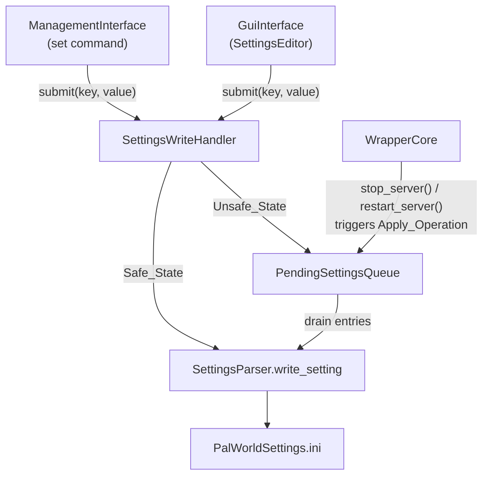
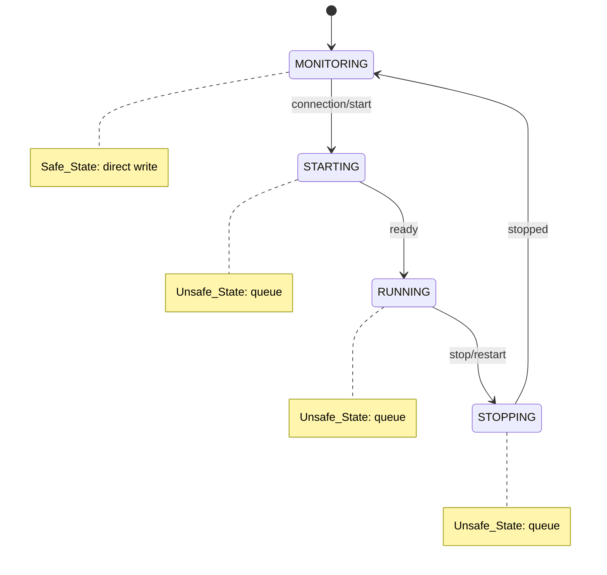
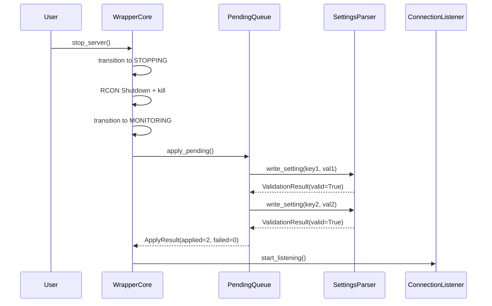

# Design Document: Settings Safe Write

## Overview

This design introduces a safety layer that prevents direct writes to `PalWorldSettings.ini` while the Palworld dedicated server is running. The core mechanism is an in-memory pending queue that accumulates setting changes during unsafe server states (STARTING, RUNNING, STOPPING) and automatically applies them atomically when the server transitions back to MONITORING state.

The design introduces three new concerns:
1. **Settings Write Handler** — a gating function that routes writes to either the live file (safe state) or the pending queue (unsafe state).
2. **Pending Settings Queue** — an ordered key-value store with last-writer-wins semantics per key.
3. **Apply Operation** — a flush procedure triggered during stop/restart transitions that drains the queue to disk.

These components are integrated into the existing `WrapperCore` lifecycle, `ManagementInterface` CLI, and `GuiInterface` GUI.

## Architecture



### State-Based Routing



### Apply Operation Integration

The Apply_Operation is invoked in `WrapperCore.stop_server()` after transitioning to MONITORING but **before** restarting the connection listener. For `restart_server()`, it occurs between the stop phase completing and the start phase beginning.



## Components and Interfaces

### 1. PendingSettingsQueue (new module: `src/pending_settings.py`)

An ordered dictionary-based queue that stores pending setting changes with last-writer-wins semantics per key.

```python
from dataclasses import dataclass, field
from collections import OrderedDict
from typing import Any


MAX_PENDING_ENTRIES = 100


@dataclass
class ApplyResult:
    """Result of applying pending settings to the file."""
    applied_count: int
    failed_key: str | None = None
    error_message: str | None = None
    remaining_count: int = 0


class PendingSettingsQueue:
    """In-memory ordered queue for pending setting changes.
    
    Stores key-value pairs with last-writer-wins semantics:
    - If a key already exists, its value is updated in-place (position preserved).
    - If a key is new, it is appended at the end.
    - Maximum capacity: 100 distinct keys.
    """

    def __init__(self) -> None:
        self._queue: OrderedDict[str, Any] = OrderedDict()

    def add(self, key: str, value: Any) -> bool:
        """Add or update an entry. Returns False if queue is full and key is new."""
        if key in self._queue:
            # Update existing key in-place (position preserved by OrderedDict)
            self._queue[key] = value
            return True
        if len(self._queue) >= MAX_PENDING_ENTRIES:
            return False
        self._queue[key] = value
        return True

    def clear(self) -> None:
        """Remove all entries from the queue."""
        self._queue.clear()

    def is_empty(self) -> bool:
        """Return True if the queue has no entries."""
        return len(self._queue) == 0

    def count(self) -> int:
        """Return the number of distinct keys in the queue."""
        return len(self._queue)

    def entries(self) -> list[tuple[str, Any]]:
        """Return all entries as (key, value) tuples in insertion order."""
        return list(self._queue.items())

    def apply(self, file_path: Path) -> ApplyResult:
        """Write all queued entries to the file in order.
        
        On failure, retains the failed entry and all subsequent entries.
        On success, clears the queue.
        """
        if self.is_empty():
            return ApplyResult(applied_count=0, remaining_count=0)

        applied = 0
        entries = list(self._queue.items())

        for key, value in entries:
            result = SettingsParser.write_setting(file_path, key, value)
            if not result.valid:
                # Retain failed entry + all subsequent entries
                remaining_keys = [k for k, _ in entries[applied:]]
                new_queue = OrderedDict()
                for k in remaining_keys:
                    new_queue[k] = self._queue[k]
                self._queue = new_queue
                return ApplyResult(
                    applied_count=applied,
                    failed_key=key,
                    error_message=result.error_message,
                    remaining_count=len(self._queue),
                )
            applied += 1

        self._queue.clear()
        return ApplyResult(applied_count=applied, remaining_count=0)
```

### 2. SettingsWriteHandler (new module: `src/settings_write_handler.py`)

A gating function that routes setting writes based on server state.

```python
from pathlib import Path
from typing import Any

from src.models import ServerState, ValidationResult
from src.pending_settings import PendingSettingsQueue
from src.settings_parser import SettingsParser
from src.wrapper_core import WrapperCore


class SettingsWriteHandler:
    """Routes setting writes to file or pending queue based on server state.
    
    - Safe_State (MONITORING): write directly via SettingsParser.write_setting
    - Unsafe_State (STARTING, RUNNING, STOPPING): validate then queue
    """

    SAFE_STATES = {ServerState.MONITORING}

    def __init__(
        self,
        wrapper_core: WrapperCore,
        pending_queue: PendingSettingsQueue,
        settings_file_path: Path,
    ) -> None:
        self._wrapper_core = wrapper_core
        self._pending_queue = pending_queue
        self._settings_file_path = settings_file_path

    def submit(self, key: str, value: Any) -> tuple[ValidationResult, bool]:
        """Submit a setting change.
        
        Returns:
            Tuple of (ValidationResult, was_queued).
            - was_queued=False means it was written directly (or failed validation).
            - was_queued=True means it was added to the pending queue.
        """
        # Always validate first
        validation = SettingsParser.validate_setting(key, value)
        if not validation.valid:
            return (validation, False)

        # Check server state
        state = self._wrapper_core.get_status().server_state
        
        if state in self.SAFE_STATES:
            # Direct write
            result = SettingsParser.write_setting(self._settings_file_path, key, value)
            return (result, False)
        else:
            # Queue the change
            if not self._pending_queue.add(key, value):
                return (
                    ValidationResult(
                        valid=False,
                        error_message="Pending queue is full (100 entries maximum)."
                    ),
                    False,
                )
            return (ValidationResult(valid=True), True)
```

### 3. WrapperCore Integration

`WrapperCore` is modified to:
- Own the `PendingSettingsQueue` instance (created in `__init__`).
- Expose a `pending_queue` property for external access.
- Call `pending_queue.apply(settings_file_path)` in `stop_server()` after transitioning to MONITORING but before restarting the connection listener.
- Call `pending_queue.apply(settings_file_path)` in `restart_server()` between stop and start phases.
- Report apply results via a callback mechanism for CLI/GUI notification.

Key integration points in `stop_server()`:

```python
# After: self._transition_to(ServerState.MONITORING, "Server stopped")
# Before: await self._connection_listener.start_listening()

apply_result = self._pending_queue.apply(self._config.settings_file_path)
if apply_result.applied_count > 0 or apply_result.failed_key:
    await self._notify_apply_result(apply_result)
```

### 4. ManagementInterface Updates

- `_cmd_set` is updated to use `SettingsWriteHandler.submit()` instead of calling `SettingsParser.write_setting()` directly.
- New command `pending` to list queued entries.
- New command `pending clear` to discard all queued entries.
- A notification callback is registered with `WrapperCore` to display apply results.

### 5. GuiInterface Updates

- `SettingsEditor._on_submit()` is updated to use `SettingsWriteHandler.submit()`.
- Feedback label shows blue "queued" message when a setting is queued.
- A pending count indicator appears in the feedback area when entries exist and server is in unsafe state.
- A notification callback displays apply results via `NotificationBar`.

## Data Models

### New Data Models

```python
@dataclass
class ApplyResult:
    """Result of applying pending settings to the settings file."""
    applied_count: int          # Number of entries successfully written
    failed_key: str | None = None       # Key that failed (if any)
    error_message: str | None = None    # Error description for the failed write
    remaining_count: int = 0    # Entries still in the queue after apply
```

### Modified Models

No existing model dataclasses are modified. The `ValidationResult` from `src/models.py` is reused as the return type from `SettingsWriteHandler.submit()`.

### Queue Internal Structure

The `PendingSettingsQueue` uses `collections.OrderedDict[str, Any]` internally:
- **Key**: Setting name (e.g., `"DayTimeSpeedRate"`)
- **Value**: The validated/corrected value ready for writing (e.g., `1.5` as float, `"True"` as str for booleans)
- **Ordering**: Insertion order of first occurrence; updating an existing key does not change its position.
- **Capacity**: 100 distinct keys maximum.

## Correctness Properties

*A property is a characteristic or behavior that should hold true across all valid executions of a system — essentially, a formal statement about what the system should do. Properties serve as the bridge between human-readable specifications and machine-verifiable correctness guarantees.*

### Property 1: State-based routing with no silent discard

*For any* valid setting key-value pair (one that passes `SettingsParser.validate_setting`) submitted to the SettingsWriteHandler: if the server is in MONITORING state, the setting SHALL be written directly to the settings file and the returned `ValidationResult` SHALL have `valid=True`; if the server is in any other state (STARTING, RUNNING, STOPPING), the setting SHALL appear in the PendingSettingsQueue with the submitted value, the settings file SHALL remain unmodified, and the returned `ValidationResult` SHALL have `valid=True`.

**Validates: Requirements 1.1, 1.2, 1.4, 7.1**

### Property 2: Validation gating

*For any* setting key-value pair where `SettingsParser.validate_setting` returns `valid=False`, the SettingsWriteHandler SHALL return an invalid `ValidationResult` without writing to the settings file or adding to the pending queue, regardless of the current server state.

**Validates: Requirements 1.5, 3.5**

### Property 3: Queue last-writer-wins with order preservation

*For any* sequence of `add(key, value)` operations on the PendingSettingsQueue, the queue SHALL contain exactly one entry per distinct key holding the most recently submitted value for that key, and iterating the queue SHALL yield keys in the order they were first inserted (first-seen order).

**Validates: Requirements 3.1, 3.2**

### Property 4: Apply operation round-trip

*For any* non-empty PendingSettingsQueue containing valid settings, after a successful `apply()` call: (a) reading the settings file SHALL produce the queued value for every key that was in the queue, (b) the queue SHALL be empty, and (c) `applied_count` SHALL equal the number of entries that were in the queue before apply.

**Validates: Requirements 2.3, 2.4, 7.4, 7.5**

### Property 5: Apply failure preserves remaining entries

*For any* PendingSettingsQueue with N entries where the K-th write fails (1 ≤ K ≤ N), after `apply()` returns: the queue SHALL contain exactly the entries from position K through N (inclusive) in their original insertion order, entries 1 through K-1 SHALL have been successfully written to the settings file, and the `ApplyResult` SHALL report `applied_count = K-1` and `remaining_count = N - K + 1`.

**Validates: Requirements 2.5**

### Property 6: Queue capacity enforcement

*For any* PendingSettingsQueue containing exactly 100 distinct keys, attempting to add a new distinct key SHALL return `False` (rejected), while updating the value of any existing key in the queue SHALL return `True` (accepted) and update the stored value.

**Validates: Requirements 3.3**

### Property 7: Empty queue apply is a no-op

*For any* empty PendingSettingsQueue and any settings file content, calling `apply()` SHALL not modify the settings file content and SHALL return `ApplyResult(applied_count=0, remaining_count=0)`.

**Validates: Requirements 3.4**

## Error Handling

### Write Failures During Direct Write (Safe_State)

- `SettingsParser.write_setting` returns a `ValidationResult` with `valid=False` and `error_message`.
- The handler returns this result directly to the caller; the setting is not queued.
- CLI/GUI display the error message to the user.

### Write Failures During Apply_Operation

- When a single entry fails during `apply()`, the operation stops immediately.
- The failed entry and all subsequent entries remain in the queue.
- The `ApplyResult` captures the failed key, error message, and remaining count.
- CLI displays: `"Error applying pending settings: {error}. M change(s) remain queued."`
- GUI displays: persistent red error notification.
- For `restart_server()`, the restart proceeds despite the failure; remaining entries will be retried on the next stop cycle.

### Queue Full

- When the queue reaches 100 distinct keys and a new key is submitted, the handler returns `ValidationResult(valid=False, error_message="Pending queue is full (100 entries maximum).")`.
- Existing key updates always succeed regardless of queue size.

### Unexpected Wrapper Termination

- The pending queue is in-memory only. If the wrapper crashes, queued entries are lost.
- The settings file is never left in a corrupted state because each `write_setting` call is atomic per-entry (read → modify → write full file content).
- This is an acceptable trade-off: the live file was never modified with the pending values, so it remains in a known-good state.

### Validation Failures

- Invalid key-value pairs are rejected before being written or queued.
- Both `SettingsParser.validate_setting` (type/range checks) and `validate_and_correct` (auto-correction with feedback) are used at the appropriate layers:
  - `validate_and_correct` at the CLI/GUI layer (user-facing feedback, auto-correction)
  - `SettingsParser.validate_setting` inside the handler (defense-in-depth)

## Testing Strategy

### Property-Based Testing (Hypothesis)

This feature is well-suited for property-based testing because it involves pure data structure logic (queue operations) and deterministic state-based routing. The testing library is **Hypothesis** (already used in the project via `tests/property/`).

**Configuration:**
- Minimum 100 iterations per property test (Hypothesis default is 100 examples)
- Each property test references its design document property via a comment tag

**Tag format:** `# Feature: settings-safe-write, Property {N}: {title}`

**Property tests to implement (one test per design property):**

1. **State-based routing with no silent discard** (Property 1) — Generate random valid settings and server states; verify writes go to file only in MONITORING state (with valid=True returned), or to queue in other states (with valid=True returned and file unchanged).
2. **Validation gating** (Property 2) — Generate invalid settings (bad types, out-of-range) across all server states; verify they are always rejected with valid=False, file unchanged, queue unchanged.
3. **Queue last-writer-wins with order preservation** (Property 3) — Generate random sequences of add operations with repeated keys; verify final queue state matches expected deduplication with first-seen key order.
4. **Apply operation round-trip** (Property 4) — Generate a queue of valid settings, apply to a temp file, read back; verify all values match, queue is empty, applied_count is correct.
5. **Apply failure preserves remaining** (Property 5) — Generate a queue of size N, mock a failure at random position K; verify entries K..N remain in order, entries 1..K-1 are written.
6. **Queue capacity enforcement** (Property 6) — Fill queue to 100 distinct keys, attempt add of new key (fails with False), update existing key (succeeds with True and value updated).
7. **Empty queue apply no-op** (Property 7) — Generate random file content, apply empty queue; verify file content unchanged and applied_count=0.

### Unit Tests (pytest)

- CLI message formatting for queued vs. applied settings
- `pending` and `pending clear` command output
- GUI notification text and color for queued/applied/error states
- Integration of apply callback in `WrapperCore.stop_server()` flow
- Edge case: apply during `restart_server()` with failure continues restart

### Integration Tests

- End-to-end flow: submit settings while server is RUNNING → stop server → verify file contains all queued values
- Verify `pending` command output matches queue state
- Verify `pending clear` empties queue and produces correct message
