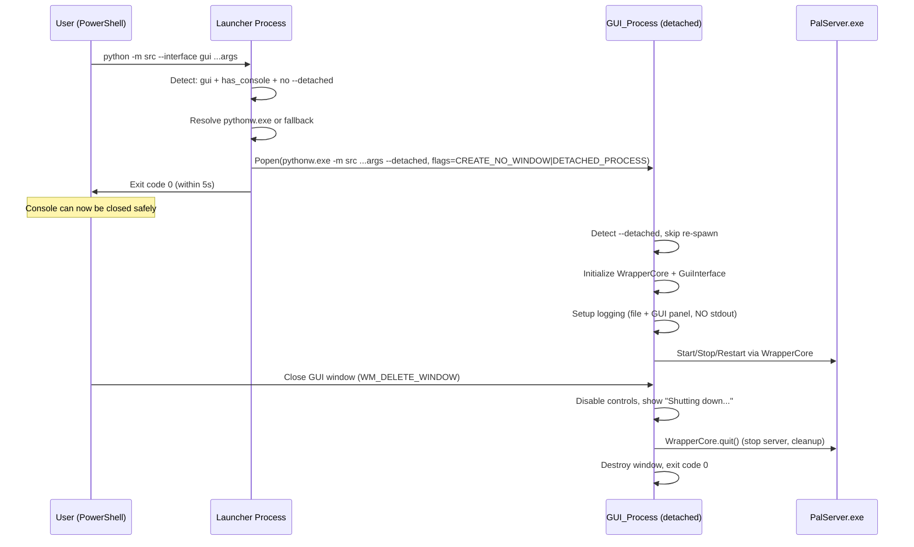

# Design Document: Standalone GUI

## Overview

This design addresses the need for the Palworld Server Wrapper's GUI mode to operate independently of the PowerShell console that launched it. On Windows, closing a console sends a `CTRL_CLOSE_EVENT` that terminates all attached processes — currently killing the GUI application.

The solution introduces a **launcher layer** that detects when GUI mode is selected, re-spawns the wrapper as a detached process using Windows process creation flags, and exits. The detached GUI process then runs the full wrapper lifecycle independently. A `--detached` flag prevents infinite re-spawn loops.

Additionally, the logging system is enhanced to support dual output modes: always-to-file plus conditionally to stdout (console mode) or to a GUI output panel (GUI mode).

### Key Design Decisions

1. **Launcher lives in `src/launcher.py`** — Separation of concerns: the launcher logic executes *before* `asyncio.run()` and should not be tangled with argument parsing or wrapper initialization.
2. **`pythonw.exe` preferred** — It prevents any console window from appearing; fallback to `python.exe` + creation flags ensures reliability in non-standard installations (e.g., virtual environments where `pythonw.exe` may not exist).
3. **`--detached` as a suppressed argparse argument** — Simplest detection mechanism; the flag is added to argparse with `help=argparse.SUPPRESS` so it doesn't pollute `--help` output.
4. **Logging handler architecture** — Rather than monkey-patching stdout, we add/remove handlers on the `WrapperLogger` class to route operational messages to the appropriate output (stdout handler for console, GUI callback handler for GUI mode).
5. **GUI Output Panel** — A new scrollable text widget in the GUI provides the same operational feedback that console mode prints to stdout, satisfying functional parity.

## Architecture

### High-Level Component Diagram

```mermaid
graph TD
    subgraph "Entry Point"
        A[__main__.py] --> B[main.py::main]
    end

    subgraph "Launcher Layer (NEW)"
        B --> C{interface == gui<br/>AND NOT --detached<br/>AND has_console?}
        C -->|Yes| D[launcher.py::detach_and_respawn]
        C -->|No| E[Continue to asyncio.run]
        D --> F[Popen pythonw.exe + --detached]
        F --> G[Launcher exits code 0]
    end

    subgraph "Wrapper Runtime"
        E --> H[asyncio.run&#40;run_wrapper&#41;]
        H --> I[WrapperCore]
        H --> J{interface mode}
        J -->|gui| K[GuiInterface]
        J -->|console| L[ManagementInterface]
    end

    subgraph "Logging (ENHANCED)"
        I --> M[WrapperLogger]
        M --> N[RotatingFileHandler - always]
        M --> O[StreamHandler stdout - console only]
        M --> P[GuiLogHandler - GUI only]
        P --> Q[GUI Output Panel]
    end
```



### Process Lifecycle Flow



## Components and Interfaces

### 1. Launcher Module (`src/launcher.py`) — NEW

**Purpose:** Handles console detachment logic before the asyncio event loop starts.

```python
"""Console detachment launcher for GUI mode on Windows.

Determines whether the current process needs to be re-spawned as a
detached GUI process, and if so, performs the spawn and exits.
"""

import subprocess
import sys
from pathlib import Path


# Windows process creation flags
CREATE_NO_WINDOW = 0x08000000
DETACHED_PROCESS = 0x00000008


def should_detach(interface_mode: str, is_detached: bool) -> bool:
    """Determine if the process should perform console detachment.

    Args:
        interface_mode: The selected interface mode ("gui" or "console").
        is_detached: Whether --detached flag is already present.

    Returns:
        True if detachment should be performed.
    """
    ...


def has_attached_console() -> bool:
    """Check if the current process has an attached console window (Windows only).

    Uses ctypes to call kernel32.GetConsoleWindow(). Returns False on non-Windows.

    Returns:
        True if a console window is attached to this process.
    """
    ...


def resolve_pythonw() -> Path | None:
    """Resolve the path to pythonw.exe from sys.executable's directory.

    Returns:
        Path to pythonw.exe if it exists, None otherwise.
    """
    ...


def detach_and_respawn(original_argv: list[str]) -> int:
    """Re-spawn the wrapper as a console-detached GUI process.

    Constructs the command line from the original arguments, appending
    --detached. Uses pythonw.exe if available, falls back to sys.executable.

    Args:
        original_argv: The original sys.argv (including script path).

    Returns:
        Exit code (0 on success, 1 on failure).

    Raises:
        OSError: Propagated from subprocess.Popen on failure.
    """
    ...
```

### 2. Enhanced `src/main.py`

**Changes:**
- Add `--detached` argument with `help=argparse.SUPPRESS`
- Call `launcher.should_detach()` after parsing args, before `asyncio.run()`
- If detachment needed, call `launcher.detach_and_respawn()` and `sys.exit()`
- Pass `is_detached` flag to `run_wrapper()` for logging configuration

```python
# In parse_args():
parser.add_argument(
    "--detached",
    action="store_true",
    default=False,
    help=argparse.SUPPRESS,  # Internal flag, hidden from --help
)

# In main(), after parse_args() and build_config():
if launcher.should_detach(args.interface, args.detached):
    exit_code = launcher.detach_and_respawn(sys.argv)
    sys.exit(exit_code)

# Otherwise continue to asyncio.run() as before
asyncio.run(run_wrapper(config, args.interface, is_detached=args.detached))
```

### 3. Enhanced `WrapperLogger` (`src/logger.py`)

**Changes:** Add support for multiple output destinations beyond file-only.

```python
class WrapperLogger:
    """Provides structured logging with rotating file output and
    optional additional handlers for console or GUI output."""

    def __init__(self) -> None:
        self._logger: logging.Logger = logging.getLogger("palworld_wrapper")
        self._gui_handler: logging.Handler | None = None
        self._console_handler: logging.Handler | None = None

    def setup(
        self,
        log_path: Path,
        max_size_mb: int = 10,
        backup_count: int = 3,
        mode: str = "console",  # NEW: "console" or "gui"
        gui_callback: Callable[[str], None] | None = None,  # NEW
    ) -> None:
        """Configure the logger with appropriate handlers based on mode.

        Always adds RotatingFileHandler.
        If mode == "console": adds StreamHandler(stdout) for operational info.
        If mode == "gui": adds GuiLogHandler that routes to gui_callback.

        Args:
            log_path: Path to the log file.
            max_size_mb: Maximum size of a single log file in megabytes.
            backup_count: Number of rotated backup files to retain.
            mode: Interface mode ("console" or "gui").
            gui_callback: Callback for GUI mode to receive log messages.
        """
        ...

    def add_console_handler(self) -> None:
        """Add a StreamHandler writing to stdout (INFO level)."""
        ...

    def add_gui_handler(self, callback: Callable[[str], None]) -> None:
        """Add a handler that routes formatted messages to a GUI callback.

        Args:
            callback: Function accepting a formatted log string, called for
                each operational-level message (INFO and above).
        """
        ...
```

### 4. `GuiLogHandler` — NEW (in `src/logger.py`)

```python
class GuiLogHandler(logging.Handler):
    """Custom logging handler that routes messages to a GUI callback.

    Thread-safe: uses the handler's lock. Filters to INFO level and above
    to show only operational messages (not DEBUG noise).
    """

    def __init__(self, callback: Callable[[str], None]) -> None:
        super().__init__(level=logging.INFO)
        self._callback = callback

    def emit(self, record: logging.LogRecord) -> None:
        """Format the record and invoke the GUI callback."""
        try:
            msg = self.format(record)
            self._callback(msg)
        except Exception:
            self.handleError(record)
```

### 5. Enhanced `GuiInterface` (`src/gui_interface.py`)

**Changes:** Add an operational output panel (scrollable text area) to the GUI layout.

```python
class OutputPanel(ttk.LabelFrame):
    """Scrollable text area displaying operational log output.

    Provides a read-only text widget that receives log messages via
    append_message(). Auto-scrolls to the latest entry. Maintains
    a maximum of 1000 lines to prevent unbounded memory growth.
    """

    MAX_LINES = 1000

    def __init__(self, parent: tk.Widget) -> None:
        """Initialize the OutputPanel.

        Args:
            parent: The parent tkinter widget.
        """
        super().__init__(parent, text="Output")
        ...

    def append_message(self, message: str) -> None:
        """Append a log message to the output panel.

        Thread-safe via root.after() scheduling. Trims oldest lines
        if MAX_LINES is exceeded. Auto-scrolls to bottom.

        Args:
            message: The formatted log message string.
        """
        ...

    def clear(self) -> None:
        """Clear all content from the output panel."""
        ...
```

**GUI Layout Update** (in `_build_ui()`):
```
Layout order (top to bottom):
1. ControlPanel - Server control buttons
2. StatusDisplay - Real-time status fields
3. OutputPanel - Operational log output (NEW)
4. SettingsView - Read-only settings display
5. SettingsEditor - Setting modification form
6. Button frame - Help and Quit buttons
7. NotificationBar - Success/error notifications (bottom)
```

### 6. CTRL_CLOSE_EVENT Handling

**Location:** In `src/launcher.py` or a new signal setup in `run_wrapper()`.

On Windows, after detachment, the GUI process should ignore `CTRL_CLOSE_EVENT` (signal `SIGBREAK` on Windows/Python). This prevents the OS from killing the process if any residual console association exists.

```python
import signal
import sys

def install_ctrl_close_handler() -> None:
    """Install a signal handler that ignores CTRL_CLOSE_EVENT on Windows.

    On non-Windows platforms, this is a no-op.
    """
    if sys.platform == "win32":
        # SIGBREAK corresponds to CTRL_CLOSE_EVENT, CTRL_BREAK_EVENT
        signal.signal(signal.SIGBREAK, signal.SIG_IGN)
```

This is called early in `run_wrapper()` when `is_detached=True`.

## Data Models

### Enhanced `WrapperConfig`

No structural changes needed. The `--detached` flag is not stored in `WrapperConfig` because it's a launcher concern, not a runtime configuration parameter. It's passed as a separate boolean to `run_wrapper()`.

### Argument Namespace Extension

```python
@dataclass
class LaunchContext:
    """Captures launch-time decisions that affect process behavior
    but are not part of the runtime configuration."""

    interface_mode: str  # "gui" or "console"
    is_detached: bool    # Whether --detached was passed
    platform: str        # sys.platform value
```

This is an optional organizational dataclass. The minimum viable implementation passes `is_detached` as a plain boolean through the call chain.

### Logging Configuration

The logging system conceptually has three output destinations:

| Destination | Console Mode | GUI Mode |
|-------------|-------------|----------|
| File (RotatingFileHandler) | Always | Always |
| stdout (StreamHandler) | INFO+ | Never |
| GUI Panel (GuiLogHandler) | Never | INFO+ |

## Correctness Properties

*A property is a characteristic or behavior that should hold true across all valid executions of a system — essentially, a formal statement about what the system should do. Properties serve as the bridge between human-readable specifications and machine-verifiable correctness guarantees.*

### Property 1: Detachment decision correctness

*For any* combination of (interface_mode, is_detached, has_console, platform) inputs, the function `should_detach()` SHALL return `True` if and only if all four conditions hold: `interface_mode == "gui"` AND `is_detached == False` AND `has_console == True` AND `platform == "win32"`. In all other cases — including when `--detached` is already present regardless of other inputs — it SHALL return `False`.

**Validates: Requirements 1.1, 1.3, 2.5, 6.2, 6.4, 6.6**

### Property 2: Argument forwarding preservation

*For any* valid list of command-line arguments passed to the launcher, the re-spawned command line SHALL contain all original arguments (in any order) plus exactly one `--detached` flag, and SHALL NOT contain any arguments not present in the original invocation (aside from `--detached`).

**Validates: Requirements 1.4, 6.1**

### Property 3: Interpreter resolution fallback

*For any* system state where `sys.executable` points to a valid Python interpreter, `resolve_pythonw()` SHALL return a `Path` to `pythonw.exe` if it exists in the same directory as `sys.executable`, and SHALL return `None` otherwise — in which case the launcher uses `sys.executable` with both creation flags applied.

**Validates: Requirements 2.2, 2.3**

### Property 4: GUI output panel line cap

*For any* sequence of N log messages appended to the OutputPanel where N > MAX_LINES, the panel SHALL contain exactly MAX_LINES lines (the most recent MAX_LINES messages), ensuring bounded memory usage.

**Validates: Requirements 4.3**

### Property 5: Logging mode exclusivity

*For any* wrapper instance, if the interface mode is "gui" then zero messages SHALL be written to stdout/stderr by the wrapper's logging system, and if the interface mode is "console" then zero messages SHALL be routed to the GUI log handler. In both modes, a RotatingFileHandler SHALL always be present.

**Validates: Requirements 4.1, 4.2, 4.4**

## Error Handling

### Launcher Errors

| Error Condition | Behavior |
|-----------------|----------|
| `pythonw.exe` not found | Fall back to `sys.executable` with creation flags |
| `subprocess.Popen` raises `OSError` | Print error to stderr, exit code 1 |
| GUI_Process fails to spawn (Popen returns but process dead) | Print error to stderr, exit code 1 |
| No display environment (TclError on tkinter init) | Print error to stderr, exit code 1 |
| Platform is not Windows | Skip detachment, run directly |

### Logging Errors

| Error Condition | Behavior |
|-----------------|----------|
| Log file cannot be opened at startup | Report via active interface (stderr or GUI notification), continue without file logging |
| Log file becomes unavailable during runtime | Report via active interface, continue operations |
| GUI callback raises exception in GuiLogHandler | `handleError()` — swallow, don't crash the logger |

### Shutdown Errors

| Error Condition | Behavior |
|-----------------|----------|
| `WrapperCore.quit()` times out (30s) | Force-destroy window, exit code 0 |
| Server process tree doesn't terminate | taskkill /F /T already handles force-kill |
| CTRL_CLOSE_EVENT received | Ignored (SIG_IGN on SIGBREAK) |

## Testing Strategy

### Unit Tests

Unit tests cover specific behaviors with concrete examples:

1. **Launcher decision logic**: Test `should_detach()` with all combinations of inputs
2. **Interpreter resolution**: Test `resolve_pythonw()` with mocked filesystem (pythonw exists / doesn't exist)
3. **Argument construction**: Test that `detach_and_respawn()` builds the correct command line
4. **CTRL_CLOSE_EVENT handler**: Test that signal handler is installed on Windows
5. **Log handler routing**: Test that `WrapperLogger.setup(mode="gui")` creates a `GuiLogHandler` and no stdout handler
6. **OutputPanel line capping**: Test that appending messages beyond MAX_LINES trims correctly
7. **OutputPanel auto-scroll**: Test that the text widget scrolls to end after append
8. **Graceful shutdown**: Test that `_shutdown()` calls `quit()` and destroys window

### Property-Based Tests

Property-based testing is appropriate for this feature because the launcher decision logic and argument forwarding are pure functions with clear input/output behavior and a meaningful input space.

**Library:** [Hypothesis](https://hypothesis.readthedocs.io/) (already available in the Python ecosystem)

**Configuration:** Minimum 100 iterations per property test.

**Tag format:** `Feature: standalone-gui, Property {number}: {property_text}`

Properties to implement as PBT:
- **Property 1** (Detachment decision): Generate all boolean/string combinations of (interface_mode, is_detached, has_console, platform) and verify `should_detach()` returns correct result
- **Property 2** (Argument forwarding): Generate arbitrary argument lists and verify the constructed command preserves all originals plus exactly one --detached
- **Property 3** (Interpreter fallback): Generate filesystem states (pythonw exists/doesn't) and verify resolution returns correct Path or None
- **Property 4** (Line cap): Generate sequences of messages with varying counts and verify OutputPanel never exceeds MAX_LINES
- **Property 5** (Logging exclusivity): Generate mode selections ("gui"/"console") and verify correct handler types are attached and incorrect ones are absent

### Integration Tests

1. **End-to-end detachment** (manual/CI): Launch with `--interface gui`, verify process is created detached, verify launcher exits quickly
2. **Console close resilience**: Launch GUI mode, close parent console, verify GUI continues running
3. **Graceful shutdown**: Close GUI window, verify server is stopped and all processes cleaned up
4. **Logging output verification**: Run in each mode, verify correct destinations receive messages
